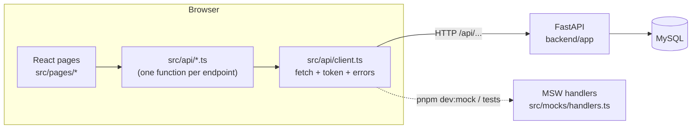
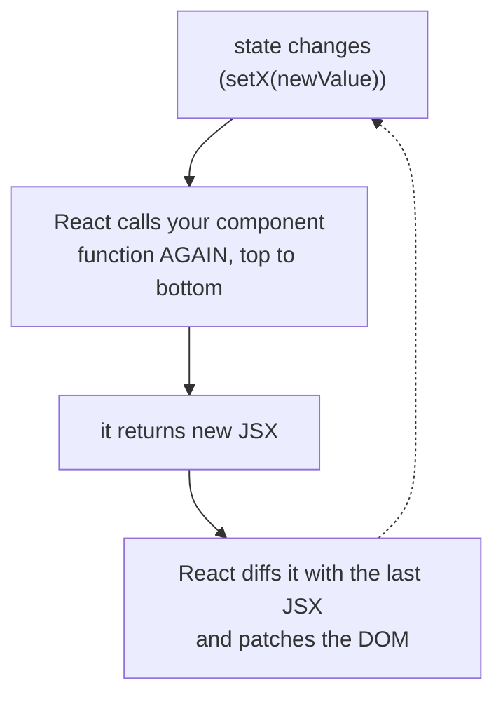
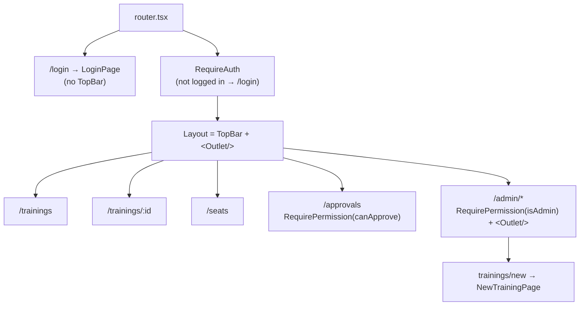
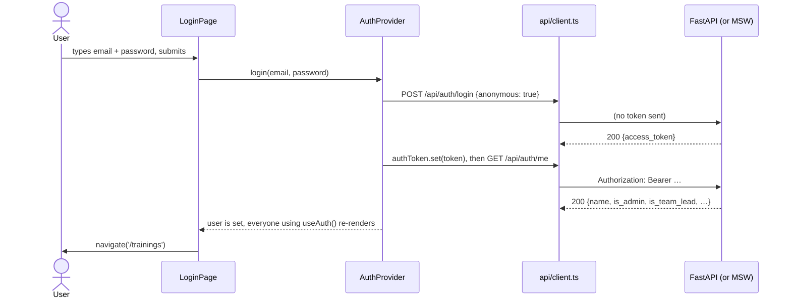
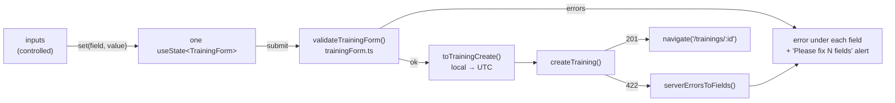
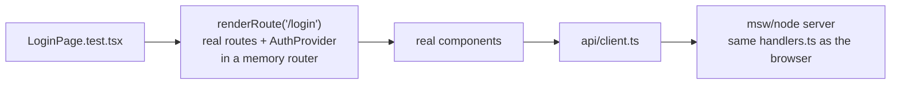

# Classroom: React for a Vue developer, taught through PreyingMantis

> **15 minutes.** Everything here comes from code we actually wrote in FE-0.3 → FE-2.1. Each section shows the React idea, the Vue idea it replaces, and the file where you can see it working.

```
 You know Vue                                You'll know after this
 ─────────────                               ──────────────────────
 .vue SFC, <template>                  →     function components + JSX
 ref / reactive / computed / watch     →     useState / derived values / useEffect
 provide / inject, composables         →     Context, custom hooks
 vue-router + beforeEach               →     React Router + guard components
 v-model                               →     controlled inputs
 <style scoped>                        →     CSS Modules
 Vue Test Utils                        →     Testing Library (+ MSW)
```

---

## 1. The big picture (1 min)



- **Pages never call `fetch`.** They call `login()`, `createTraining()` and so on from `src/api/`. Only `client.ts` knows the URL and the token.
- **MSW** (Mock Service Worker) intercepts those same HTTP calls. In the browser it uses a Service Worker; in tests it uses `msw/node`. The app code doesn't know whether it's talking to FastAPI or to a mock.
- **Types come from the backend.** `pnpm gen:api` reads FastAPI's `/openapi.json` and writes `src/api/schema.d.ts`. If Diogo renames a field, our build breaks instead of production.

---

## 2. Where things live (2 min)

```
frontend/src/
├── main.tsx              ← createApp(App).mount('#app')  → createRoot(...).render(<AuthProvider><RouterProvider/></AuthProvider>)
├── router.tsx            ← router/index.ts (the route table + guards)
├── api/
│   ├── client.ts         ← your axios instance: base URL, auth header, 401 handling
│   ├── auth.ts, trainings.ts, users.ts   ← one function per endpoint
│   └── schema.d.ts       ← GENERATED from FastAPI (never edit)
├── auth/                 ← a Pinia "auth store", done with React Context
│   ├── AuthProvider.tsx  ← holds the user, login(), logout()
│   ├── useAuth.ts        ← the composable: const { user } = useAuth()
│   ├── RequireAuth.tsx   ← guard: logged in?
│   ├── RequirePermission.tsx + permissions.ts  ← guard: allowed?
├── components/           ← reusable UI (TopBar, TextField, Button, TrainerPicker…), each with a .module.css
├── pages/                ← one component per route (views/ in a Vue project)
├── trainings/trainingForm.ts  ← plain TS: form type, validation, API mapping (no React inside)
├── hooks/useDebouncedValue.ts ← composables/ in Vue
├── lib/datetime.ts       ← utils/
├── mocks/                ← MSW: handlers.ts (shared), browser.ts, server.ts (tests), data/users.ts
├── test/                 ← setup.ts (runs before every test file), render.tsx (helpers)
└── styles/tokens.css     ← the Figma variables as CSS custom properties
```

**A rule worth stealing:** logic that doesn't need React (validation, conversions) goes in plain `.ts` files (`trainingForm.ts`). They're easy to test and easy to reuse.

---

## 3. React's mental model in one picture (3 min)

This is the part that differs most from Vue.



- **Vue:** the component's `setup()` runs **once**. Reactivity (Proxies) tracks which refs a template reads and updates just those parts.
- **React:** the component is a function that runs **on every render**. There's no tracking: `setState` means "run me again".

The consequences, each with a place you can see it in our code:

| Vue | React | Where we use it |
|---|---|---|
| `const n = ref(0)`; `n.value++` | `const [n, setN] = useState(0)`; `setN(n + 1)` | `LoginPage.tsx`: `email`, `password`, `error` |
| `reactive(obj)`; `obj.name = 'x'` | `setForm({ ...form, name: 'x' })`. **Always a new object**, since React compares by reference | `NewTrainingPage.tsx`: the `set(field, value)` helper |
| `computed(() => a + b)` | just `const sum = a + b` in the body (it re-runs anyway) | `TopBar.tsx`: `menuOpen = menuOpenedAt === pathname` |
| `watch(src, fn)` / `onMounted` | `useEffect(fn, [deps])`. It runs after render when a dependency changed, and **returns a cleanup** | `AuthProvider.tsx`: check the token on mount |
| `v-if` / `v-for` | `{cond && <X/>}` / `{list.map(i => <Li key={i.id}/>)}` | `TopBar.tsx`: nav links filtered by permission |
| default slot | `children` prop | `PageHeader`: `<PageHeader title="…">subtitle</PageHeader>` |
| named slot | any prop that takes JSX | `PageHeader`: `actions={<ButtonLink …/>}` |
| `provide` / `inject` | `<Ctx value={…}>` / `useContext(Ctx)` | `AuthContext.ts` + `useAuth.ts` |
| composable `useX()` | custom hook `useX()` (a function that calls hooks) | `useAuth`, `useDebouncedValue` |

### Side by side: the same login field

```vue
<!-- Vue -->
<script setup>
const email = ref('')
</script>
<template>
  <input v-model="email" />
</template>
```

```tsx
// React (LoginPage.tsx)
const [email, setEmail] = useState('')
return <input value={email} onChange={(e) => setEmail(e.target.value)} />
```

That's a **controlled input**: React state is the single source of truth, and every keystroke goes through `onChange`. It's more typing than `v-model`, but nothing happens implicitly.

### The two rules of hooks
1. Only call hooks at the **top level** of a component or custom hook, never inside `if`, loops or callbacks. React identifies each `useState` by its **call order**. The linter (`react/rules-of-hooks`) enforces this.
2. Custom hooks must start with `use`, so the linter knows to check them.

That's why `LoginPage` declares all its `useState`s first, and only then does `if (user) return <Navigate …/>`.

### `useEffect` needs a cleanup (StrictMode shows you why)

```tsx
// AuthProvider.tsx, simplified
useEffect(() => {
  let ignore = false
  getMe().then((me) => !ignore && setUser(me))
  return () => { ignore = true }   // cleanup: runs before the next effect and on unmount
}, [])
```

In dev, `<StrictMode>` mounts, unmounts and remounts every component on purpose, so a missing cleanup shows up straight away. Vue has no equivalent of this double-run. Our debounce hook is just an effect whose cleanup cancels the timer:

```tsx
// hooks/useDebouncedValue.ts
useEffect(() => {
  const timer = setTimeout(() => setDebounced(value), delayMs)
  return () => clearTimeout(timer)   // a new keystroke → the old timer is cancelled
}, [value, delayMs])
```

### `useRef` = a box that survives renders without causing one
In `TrainerPicker.tsx`, the "close the list after blur" timer lives in `useRef`. It must survive re-renders, but changing it shouldn't re-render anything. (This fixed a real CI failure; see §8.)

---

## 4. Routing: React Router vs vue-router (2 min)



| vue-router | React Router (v8) |
|---|---|
| `routes: [{ path, component }]` | `routes: [{ path, element: <Page/> }]`: you pass **JSX**, not the component |
| `<router-view>` | `<Outlet />` |
| `router.beforeEach(to => …)` | a **component** that renders either its children or `<Navigate to="/login" replace />` |
| `meta: { requiresAdmin: true }` | a route with no page whose element is a guard around `<Outlet />`. Every child is then protected. |
| `<router-link>` + `router-link-active` | `<NavLink className={({isActive}) => …}>` |
| `useRoute().params.id` | `useParams().id` (always a **string**) |
| `router.push('/x')` | `const navigate = useNavigate(); navigate('/x')` |
| `createMemoryHistory()` | `createMemoryRouter(routes, { initialEntries: ['/x'] })`, used in our tests |

---

## 5. Login: how the pieces talk (2 min)



What to take from it:
- **Context is only a pipe.** `AuthProvider` owns `useState(user)`. Context passes it down so any component can read it with `useAuth()`. It isn't reactive by itself: consumers re-render because the provider renders with a **new value**. That's why the value is wrapped in `useMemo` and the functions in `useCallback`.
- **A 401 from anywhere logs you out.** `client.ts` can't import React, so `AuthProvider` registers a listener with `onUnauthorized(() => setUser(null))`. `RequireAuth` then sees `user === null` and redirects. The login call is marked `anonymous`, so a wrong password shows an error instead of logging you out.
- **After a refresh**, a token in localStorage is only trusted once `/me` accepts it. Meanwhile `status: 'checking'` renders nothing, so the login page doesn't flash.
- **Token storage trade-off:** localStorage survives refreshes but any injected script can read it (XSS). An httpOnly cookie is safer, but needs CSRF protection. See `decisions.md`.

---

## 6. Permissions: hide in the UI, enforce in the backend (1 min)

```ts
// auth/permissions.ts: the one place the frontend rules live
export const isAdmin: Permission = (user) => user.is_admin
export const canApprove: Permission = (user) => user.is_team_lead || user.is_admin
```

The same functions drive three things: nav links (`visibleTo: canApprove`), the "+ New training" button, and route guards (`<RequirePermission allow={isAdmin}>`). **None of this is security.** Anyone can call the API from devtools, so FastAPI's `require_admin` answers 403 regardless. The UI just doesn't offer what you can't use.

---

## 7. A real form: create training (2 min)

`/admin/trainings/new` is the most "React" screen so far. Here's what's inside it:



- **One object, typed setter.** `set<K extends keyof TrainingForm>(field: K, value: TrainingForm[K])` stops you from writing `set('name', 42)`. Each call builds a new object with `{ ...current, [field]: value }`.
- **Validation lives on both sides.** The backend (`TrainingCreate` with Pydantic validators) has the final say. The frontend mirrors the rules for fast feedback and also maps FastAPI's 422 format onto fields:
  ```json
  {"detail": [{"loc": ["body", "max_seats"], "msg": "…"},
              {"loc": ["body"], "msg": "Value error, ends_at must be after starts_at"}]}
  ```
  `loc[1]` names the field. A whole-model error (`loc: ["body"]`) names it inside `msg`, so we mark the field mentioned first.
- **Dates: the classic JavaScript trap.**
  - `<input type="datetime-local">` gives `"2026-10-14T09:00"`, with no time zone.
  - `new Date("2026-10-14T09:00")` reads it as **local** time, so `.toISOString()` gives `"2026-10-14T08:00:00.000Z"` in Lisbon.
  - But `new Date("2026-10-14")` (no time) is read as **UTC**.
  - Java makes this explicit (`LocalDateTime` vs `Instant`); JavaScript's `Date` doesn't.
- **A browser bug we hit by hand:** Chrome's year box takes 6 digits unless the input has `max`, so typing `20102026` then `0900` put `202609` in the year. `max="9999-12-31T23:59"` fixed it. Tests didn't catch this; clicking through the form did.
- **The trainer picker** is an ARIA combobox: `role="combobox"` on the input, and `role="listbox"` + `role="option"` for the list. It supports ↑/↓/Enter/Esc and a debounced search. It uses `onMouseDown` + `preventDefault()` on options, so the input doesn't blur (and close the list) before the click lands.
- **`useId()`** creates the ids that tie a `<label>`, the help text and `aria-describedby` to the right input. Every `TextField` gets its own.

---

## 8. Testing like a user (2 min)



- **Vitest** has Jest's API (`describe`, `it`, `expect`) and reads `vite.config.ts`, so there's no separate setup.
- **jsdom** is a fake DOM in Node: it has elements and events, but no layout or CSS. So we test *what* is on screen, not how it looks.
- **Testing Library queries the way a user finds things,** by role and accessible name. It has no `wrapper.vm` and no CSS selectors:
  ```ts
  await user.type(screen.getByLabelText('Email'), 'sofia@preyingmantis.test')
  await user.click(screen.getByRole('button', { name: 'Log in' }))
  expect(await screen.findByRole('link', { name: 'Sofia Martins' })).toBeInTheDocument()
  ```
  - `getBy…` = must be there now
  - `queryBy…` = may be absent (returns `null`)
  - `findBy…` = wait for it (after a fetch)
- **One endpoint, one test override:** `server.use(http.post('*/api/trainings', () => HttpResponse.json({detail: […]}, {status: 422})))`.
- **The time zone is pinned** (`TZ=Europe/Lisbon` in `vite.config.ts`), so "09:00 → 08:00Z" holds on every machine.
- **Our rule:** only test behaviour from a story's acceptance criteria. Never test placeholders.

**A war story from this morning:** CI failed on one test that passed locally.
- **Cause:** `TrainerPicker` closed its list 150 ms after a blur, but never cancelled that timer when the field got focus again. On the slower CI machine, the old timer fired after we reopened the list and closed it under our feet.
- **Fix:** keep the timer in a `useRef` and `clearTimeout` it on focus.
- **Proof:** I added a test that fails without the fix.

Timing bugs like this also hit real users who tab back quickly.

---

## 9. Styling (30 s)

| Vue `<style scoped>` | CSS Modules (`TopBar.module.css`) |
|---|---|
| keeps your class names, adds `data-v-xxxx` | **renames** classes: `import styles from './X.module.css'` → `className={styles.bar}` |
| `:deep(.child)` | none: pass a `className` prop, or target structure (`.page :global(header)`) |
| `:class="{ active: isActive }"` | plain strings: `` `${styles.item} ${isActive ? styles.active : ''}` `` |

Colours and spacing come from `styles/tokens.css`, which mirrors the Figma variables: `var(--color-action-primary)`, never a raw hex.

---

## 10. Cheat sheet: things that bit us or will bite you

- `{count && <Badge/>}` renders **`0`** when count is 0. Write `count > 0 && …`.
- Mutating state (`form.name = 'x'`) does **nothing** on screen. Always `setX(newValue)`.
- An effect that fetches needs an `ignore` flag (or TanStack Query, coming in FE-2.2).
- `useState(() => expensive())` runs the function once. `useState(expensive())` runs it on every render.
- A route guard is a component, and `replace` on `<Navigate>` keeps Back from bouncing.
- Env vars (`import.meta.env.VITE_*`) are baked in at **build** time, as strings. Compare them with `=== 'true'`.
- `new Date('YYYY-MM-DD')` is UTC; `new Date('YYYY-MM-DDTHH:mm')` is local.
- `onMouseDown` + `preventDefault()` on an option keeps the input focused, so blur doesn't eat your click.
- Timers and subscriptions started in an effect must be stopped in its cleanup (or held in a `useRef` and cleared).

---

## Check yourself (1 min)

<details><summary>1. Why can't a component call <code>useState</code> inside an <code>if</code>?</summary>

React identifies hooks by their call order on every render. A conditional hook shifts the order, and state ends up attached to the wrong hook.
</details>

<details><summary>2. What's the React equivalent of <code>computed</code>?</summary>

Usually a plain variable in the component body, because the body re-runs on every render. Use `useMemo` only when the calculation is expensive or you need a stable reference (like the Context value in `AuthProvider`).
</details>

<details><summary>3. The user types "sofia" in the trainer field. How many requests go out, and why?</summary>

One search for "sofia", plus the first list loaded when the field opened. `useDebouncedValue` resets its timer on every keystroke (the effect's cleanup clears it), so only a value that stays unchanged for 300 ms triggers a search. "s", "so", "sof" and "sofi" never do.
</details>

<details><summary>4. Why does hiding "Approvals" not protect <code>/api/approvals</code>?</summary>

The UI is just a client. Anyone can call the API with their token. FastAPI checks every rule itself and returns 403.
</details>

<details><summary>5. Your test passes locally and fails in CI with "Unable to find role…". Where do you look first?</summary>

Timing: debounce, `setTimeout`, and missing `await`/`findBy`. A timer from an earlier step can fire late on a slower machine. Make the code cancel stale timers, and make tests wait with `findBy` rather than assume.
</details>
