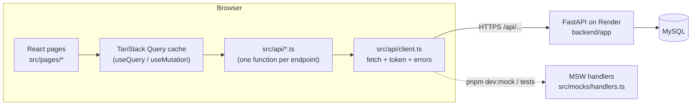
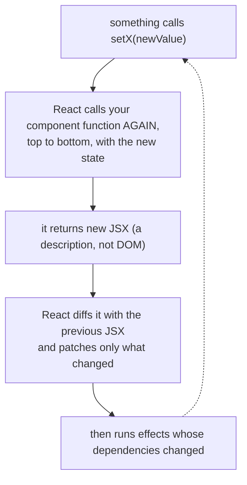
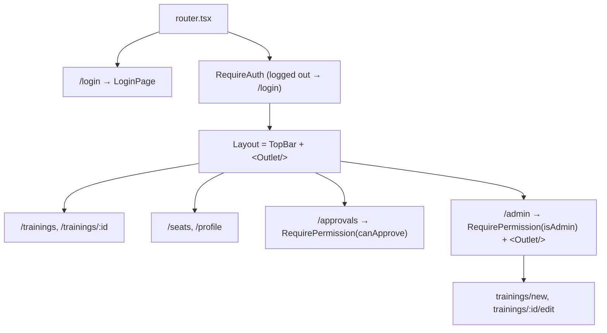
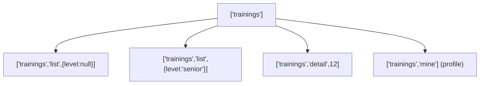
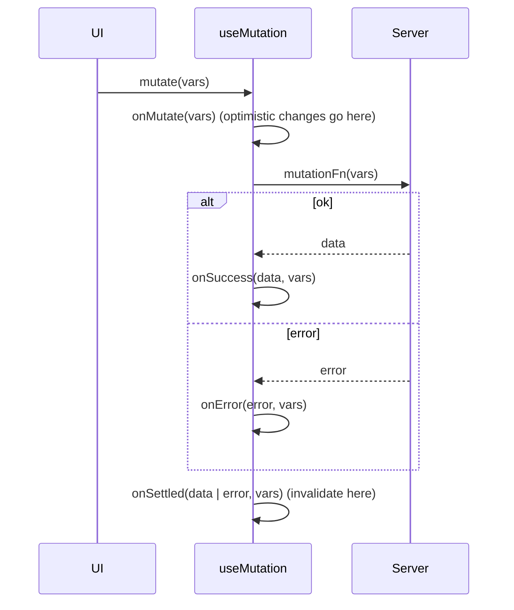
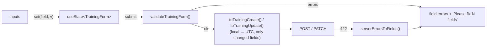
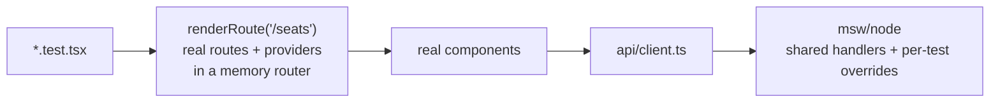

# Classroom: React for a Vue developer, taught through PreyingMantis

Two parts, both built from code we actually wrote (FE-0.3 → FE-7.2):

- **Part 1: the tour (15 min).** The mental model, the file map, and how the pieces talk to each other.
- **Part 2: the deep dive (≈ 60 min).** Twelve chapters. Each one takes a React idea, shows the Vue idea it replaces, quotes the file where we use it, and explains the trap we fell into (or nearly did). Part 2 ends with **exercises you can do in this codebase**, with hints and solutions.

```
 You know Vue                                You'll know after this
 ─────────────                               ──────────────────────
 .vue SFC, <template>                  →     function components + JSX
 ref / reactive / computed / watch     →     useState / derived values / useEffect
 template refs                         →     useRef (DOM nodes *and* mutable boxes)
 provide / inject, composables         →     Context, custom hooks
 props + emit, slots                   →     props (incl. functions and JSX)
 vue-router + beforeEach               →     React Router + guard components
 v-model                               →     controlled inputs
 Pinia + fetch in onMounted            →     TanStack Query (useQuery / useMutation)
 <style scoped>                        →     CSS Modules
 Vue Test Utils                        →     Testing Library (+ MSW)
```

---

# Part 1: the tour

## 1. The big picture



- **Pages never call `fetch`.** They call `useQuery({ queryFn: listTrainings })` or `useMutation({ mutationFn: reserveSeat })`, and those call `src/api/*.ts`. Only `client.ts` knows the URL and the token.
- **MSW** (Mock Service Worker) answers the same HTTP calls in `pnpm dev:mock` and in tests, so the app code doesn't know whether it's talking to FastAPI or to a mock.
- **Types come from the backend.** `pnpm gen:api` turns FastAPI's `/openapi.json` into `src/api/schema.d.ts`. When Diogo renames a field, our build breaks instead of production.

## 2. Where things live

```
frontend/src/
├── main.tsx              ← createApp(App).use(pinia).mount()  →  <QueryClientProvider><AuthProvider><RouterProvider/>…
├── router.tsx            ← router/index.ts: the route table + guards
├── api/
│   ├── client.ts         ← your axios instance: base URL, Bearer token, 401 → logout, ApiError
│   ├── queryClient.ts    ← the TanStack cache + every query key (one place!)
│   ├── auth.ts, trainings.ts, enrollments.ts, notifications.ts, seats.ts, users.ts
│   └── schema.d.ts       ← GENERATED from FastAPI (never edit)
├── auth/                 ← a Pinia "auth store", done with Context
│   ├── AuthProvider.tsx, AuthContext.ts, useAuth.ts
│   ├── RequireAuth.tsx, RequirePermission.tsx, permissions.ts
├── components/           ← reusable UI, each with a .module.css
│     TopBar, NotificationBell, TrainingCard, TrainingForm, TrainerPicker, ConfirmDialog,
│     JoinButton, WithdrawButton, ApprovalRow, SeatMap, Seat, DayPicker, MyReservations…
├── pages/                ← one component per route (views/ in Vue)
├── trainings/            ← plain TS: trainingForm.ts (validation, API mapping), levels.ts, display.ts
├── enrollments/          ← plain TS: joinState.ts, messages.ts (error code → sentence)
├── seats/                ← plain TS: seatState.ts
├── hooks/                ← composables/: useDebouncedValue
├── lib/                  ← utils/: datetime.ts (instants, UTC), days.ts (calendar days)
├── mocks/                ← MSW: handlers.ts, data/*.ts (a tiny fake backend), browser.ts, server.ts
└── test/                 ← setup.ts, render.tsx (renderRoute, storeLoginToken)
```

**The rule worth stealing:** anything that doesn't need React (validation, "which label does this button show", error-code mapping) lives in a plain `.ts` file. Components stay thin, and that logic is trivial to test.

## 3. React's mental model in one picture

This is where React differs most from Vue.



- **Vue:** `setup()` runs **once**. Reactivity (Proxies) tracks which refs the template reads and updates just those parts.
- **React:** the component is a function that runs **on every render**. Nothing is tracked. `setState` means "run me again", and each render sees a **snapshot** of state.

## 4. The Vue → React table (with where we use each)

| Vue | React | In our code |
|---|---|---|
| `ref(0)`; `n.value++` | `const [n, setN] = useState(0)`; `setN(n + 1)` | `LoginPage.tsx`: `email`, `password`, `error` |
| `reactive(obj)`; `obj.x = 1` | `setForm(f => ({ ...f, x: 1 }))`: always a **new** object | `TrainingForm.tsx`: the `set(field, value)` helper |
| `computed(() => …)` | a plain `const` in the body | `JoinButton.tsx`: `const state = joinState(training)` |
| `watch` / `onMounted` | `useEffect(fn, [deps])`, which returns a cleanup | `ConfirmDialog.tsx`, `useDebouncedValue.ts` |
| template ref | `useRef<HTMLDialogElement>(null)` | `ConfirmDialog.tsx`, `NotificationBell.tsx` |
| `v-if` / `v-for` | `{cond && <X/>}` / `{list.map(i => <Li key={i.id}/>)}` | everywhere; keys matter (§ 2.4) |
| default slot / named slot | `children` / any prop that takes JSX | `PageHeader`: `children` + `actions={…}` |
| `emit('submit', form)` | a function prop: `onSubmit(form)` | `TrainingForm` → `NewTrainingPage`, `EditTrainingPage` |
| `provide` / `inject` | `<Ctx value={…}>` / `useContext(Ctx)` | `AuthContext.ts` + `useAuth.ts` |
| composable `useX()` | custom hook `useX()` | `useAuth`, `useDebouncedValue` |
| Pinia store + fetch | `useQuery` / `useMutation` | every page since FE-2.2 |

## 5. Routing in one diagram



`<Outlet />` = `<router-view>`. Guards are **components** that render either their children or `<Navigate to="/login" replace />`, instead of a `beforeEach`.

## 6. Login: how the pieces talk

```mermaid
sequenceDiagram
  actor U as User
  participant LP as LoginPage
  participant AP as AuthProvider
  participant QC as Query cache
  participant C as client.ts
  participant BE as FastAPI (or MSW)
  U->>LP: submit
  LP->>AP: login(email, password)
  AP->>C: POST /api/auth/login (anonymous)
  C->>BE: no token
  BE-->>AP: {access_token}
  AP->>C: authToken.set(token)
  AP->>QC: fetchQuery(['me'], getMe)
  QC->>BE: GET /api/auth/me (Bearer …)
  BE-->>QC: {name, is_admin, is_team_lead, …}
  AP-->>LP: resolved; useAuth().user is set everywhere
  LP->>U: navigate('/trainings')
```

Any later 401 clears the token and calls the listener that `AuthProvider` registered (`onUnauthorized`). The user becomes `null`, and `RequireAuth` redirects. Logout also calls `queryClient.clear()`, so the next person on this browser sees none of your data.

---

# Part 2: the deep dive

## 2.1 Renders, snapshots and batching

**The idea.** Every render is a function call with its own copy of props and state, a *snapshot*. The event handlers created during that render see that snapshot forever.

```tsx
const [count, setCount] = useState(0)
function onClick() {
  setCount(count + 1)
  setCount(count + 1)   // still count === 0 in this snapshot → ends at 1, not 2
  console.log(count)    // 0: the new value only exists in the *next* render
}
```

Vue would give you 2 and log 2, because `count.value` is a live proxy. React instead **batches** both calls into one re-render, and both read the same snapshot.

**The fix is the functional form**, which is what our form uses (`components/TrainingForm.tsx`):

```tsx
function set<K extends keyof TrainingFormState>(field: K, value: TrainingFormState[K]) {
  setForm((current) => ({ ...current, [field]: value }))
}
```

`current` is always the latest state, even if several updates happen in the same event. The spread makes a **new object**. React compares state with `Object.is`, so mutating (`form.name = 'x'`) changes nothing on screen.

**The rule:** if the new state depends on the old state, pass a function to the setter.

## 2.2 Derive, don't sync

Most of what Vue does with `computed` needs *no hook at all* in React, because the body runs again anyway. From `components/JoinButton.tsx`:

```tsx
const state = joinState(training)   // 'can_join' | 'pending' | 'enrolled' | 'rejected' | 'full' | …
const hint = JOIN_HINTS[state]
```

`joinState()` is a plain function in `enrollments/joinState.ts`. There's no `useState(training.my_enrollment_status)`, and no `useEffect` that "keeps it in sync".

**The anti-pattern we avoided:**

```tsx
// ✗ Copies server data into state: it freezes. After "Request to join" refetches the training,
//   this still shows the old status until something else calls setStatus.
const [status, setStatus] = useState(training.my_enrollment_status)
useEffect(() => setStatus(training.my_enrollment_status), [training])   // ✗ an extra render, just to catch up
```

Another example is `TopBar.tsx`, which closes the phone menu on navigation without an effect:

```tsx
const [menuOpenedAt, setMenuOpenedAt] = useState<string | null>(null)
const menuOpen = menuOpenedAt === pathname   // navigate → pathname changes → menuOpen is false. No effect.
```

`useMemo` is only for *expensive* derivations, or when you need a **stable reference** (§ 2.6).

## 2.3 Effects: only for syncing with something outside React

`useEffect(fn, deps)` runs **after** the render is on screen, whenever a value in `deps` changed. The function it returns (the *cleanup*) runs before the next run and on unmount. React's docs put it well: *effects are for synchronizing with an external system.* Every effect in our code fits that description:

| Effect | External system | File |
|---|---|---|
| open/close the native dialog | the DOM's `<dialog>` | `ConfirmDialog.tsx` |
| Escape and click-outside listeners | `document` | `NotificationBell.tsx` |
| subscribe to 401s | `client.ts`'s listener | `AuthProvider.tsx` |
| a debounce timer | `setTimeout` | `hooks/useDebouncedValue.ts` |
| search users while typing | the network | `TrainerPicker.tsx` (the last hand-written fetch) |

The dialog is the cleanest example. React holds `open` in state, the browser holds the dialog's real state, and the effect keeps the two in step:

```tsx
useEffect(() => {
  const dialog = ref.current
  if (!dialog) return
  if (open && !dialog.open) dialog.showModal()
  if (!open && dialog.open) dialog.close()
}, [open])
```

The bell's listeners show why the **cleanup** matters (`NotificationBell.tsx`):

```tsx
useEffect(() => {
  if (!open) return
  panelRef.current?.focus()
  function onKeyDown(event: KeyboardEvent) { if (event.key === 'Escape') close({ restoreFocus: true }) }
  function onPointerDown(event: PointerEvent) {
    if (!wrapperRef.current?.contains(event.target as Node)) close({ restoreFocus: false })
  }
  document.addEventListener('keydown', onKeyDown)
  document.addEventListener('pointerdown', onPointerDown)
  return () => {                      // without this, every open stacks one more pair of listeners
    document.removeEventListener('keydown', onKeyDown)
    document.removeEventListener('pointerdown', onPointerDown)
  }
}, [open])
```

**The dependency array is not optional.** It's how React knows when your effect is out of date. `[open]` means "re-run when `open` changes". `[]` means "only on mount". No array at all means "after *every* render", which is almost never what you want.

**StrictMode runs every effect twice in development** (mount → cleanup → mount). It's a smoke test: if your effect breaks when run twice, it would also break in real life (fast navigation, a remount). That's why the old `/me` fetch needed an `ignore` flag, and why `TrainerPicker`'s search still has one:

```tsx
useEffect(() => {
  if (!open) return
  let ignore = false
  searchUsers(search).then((found) => { if (!ignore) setUsers(found) })
  return () => { ignore = true }      // a slow answer for an old `search` must not overwrite a newer one
}, [open, search])
```

**Vue translation:** `watch(src, fn, { immediate: true })` with `onCleanup` is the closest thing to it. `watchEffect` tracks dependencies automatically; React makes you list them.

## 2.4 Lists, keys and component identity

`key` tells React *which* element is which between renders. It's the same as `:key` in `v-for`, but with a sharper consequence: **React keeps a component's state attached to its key.**

From `pages/ApprovalsPage.tsx`:

```tsx
{approvals.data.map((item) => (
  <li key={item.enrollment.id}>
    <ApprovalRow item={item} />      {/* each row owns its own comment in useState */}
  </li>
))}
```

With `key={index}`: approve row 0 and it disappears. The row that *was* index 1 is now index 0, and React hands it row 0's state, including **the comment you typed for someone else**.

Keys also let you **reset** a component on purpose. From `pages/EditTrainingPage.tsx`:

```tsx
<TrainingForm key={id} initial={initial} … />
```

`useState(initial)` only reads `initial` on the **first** render. Without `key={id}`, moving from editing training 3 to training 7 would keep training 3's form state. A new key means a new component instance, so the form starts fresh. There's no Vue equivalent this blunt; you'd reach for `:key` on the component too.

## 2.5 Refs: DOM nodes *and* boxes that don't re-render

`useRef` does two jobs:

1. **A template ref:** `const ref = useRef<HTMLDialogElement>(null)`, then `<dialog ref={ref}>`, then `ref.current.showModal()`.
2. **A mutable box that survives renders but doesn't cause them.** Changing `ref.current` never re-renders.

Job 2 fixed our worst bug of the day (`components/TrainerPicker.tsx`):

```tsx
// The pending "close after blur" timer. A ref, not state: changing it must not re-render.
const closeTimer = useRef<ReturnType<typeof setTimeout>>(undefined)

function openList() {
  clearTimeout(closeTimer.current)     // coming back before the timer fires keeps the list open
  setOpen(true)
}
…
onBlur={() => { closeTimer.current = setTimeout(() => setOpen(false), 150) }}
```

**What happened:** the picker closed its list 150 ms after a blur, but never cancelled that timer when the field got focus again. It passed on our laptops and failed in CI. On the slower machine, the old timer fired *after* the test reopened the list and closed it under its feet. Real users who tab back quickly would hit the same thing. A timer ID is exactly the kind of value that must survive renders, but isn't UI, so it belongs in a ref.

**Rule of thumb:** if the screen should change when the value changes, use state. If it shouldn't, use a ref.

## 2.6 Context, identity, `useMemo` and `useCallback`

Context is a pipe: `AuthProvider` owns the state, and `<AuthContext value={…}>` makes it readable anywhere below with `useContext`. Unlike Vue's `inject()`, the value **isn't reactive**. Consumers re-render when the provider renders with a **different value object** (compared with `Object.is`).

That's why `AuthProvider.tsx` does this:

```tsx
const logout = useCallback(() => {
  authToken.clear()
  setHasToken(false)
  queryClient.clear()
}, [queryClient])

useEffect(() => onUnauthorized(logout), [logout])      // re-subscribes only if logout changes

const value = useMemo(() => ({ user, status, login, logout }), [user, status, login, logout])
return <AuthContext value={value}>{children}</AuthContext>
```

- Without `useMemo`, every `AuthProvider` render creates a new `{…}`, and **every** `useAuth()` consumer re-renders.
- Without `useCallback`, `logout` is a new function each render. The effect above would unsubscribe and re-subscribe every time.

These two hooks are about **identity**, not speed. You need them when a value is used as a dependency or passed through Context. In most other places, a new function each render is fine.

`useAuth()` also shows how to write a custom hook that fails loudly:

```tsx
export function useAuth() {
  const auth = useContext(AuthContext)
  if (auth === null) throw new Error('useAuth() must be used inside <AuthProvider>')
  return auth
}
```

## 2.7 Composition: props are the whole API

React has no emits and no slots, only props. But props can be **anything**: values, JSX, and functions.

| Vue | React (our code) |
|---|---|
| `<slot/>` | `children` in `PageHeader`: `<PageHeader title="Seats">Reserve a seat…</PageHeader>` |
| `<slot name="actions"/>` | a JSX prop: `<PageHeader actions={<ButtonLink to="…">+ New training</ButtonLink>}>` |
| `emit('submit', form)` | a function prop: `<TrainingForm onSubmit={create} />` |
| `emit('select', seat)` | `<SeatMap onSelect={setSelected} />` |

**One form, two pages** (FE-2.4). `TrainingForm` owns the state, validation and error display. The pages only decide what "submit" means:

```tsx
// NewTrainingPage.tsx
<TrainingForm initial={emptyTrainingForm} submitLabel="Create training" onSubmit={create} … />

// EditTrainingPage.tsx
<TrainingForm key={id} initial={initial} editing submitLabel="Save changes" onSubmit={save} … />
```

`onSubmit` returns a promise. If it throws an `ApiError`, the form puts 422s on fields and 409s in the alert. So even error handling is shared.

**Lifting state up** is how siblings talk. `SeatsPage` owns `selected`, the map sets it, and the dialog reads it:

```tsx
const [selected, setSelected] = useState<Seat | null>(null)
…
<SeatMap seats={seats.data} myZone={user.client} onSelect={setSelected} />
<ReserveSeatDialog seat={selected} day={day} mySeat={mySeat} onClose={() => setSelected(null)} />
```

In Vue you might reach for a store or an event bus. In React, the common parent holds the state.

## 2.8 TanStack Query: the server cache

This replaced most of our `useEffect`s. Think of it as a Pinia store that knows about fetching, caching, refetching and staleness.

### Keys are a hierarchy

From `api/queryClient.ts`:

```ts
trainings: ['trainings'],
trainingList: (level) => ['trainings', 'list', { level }],
trainingDetail: (id) => ['trainings', 'detail', id],
myEnrollments: ['trainings', 'mine'],          // under 'trainings' on purpose
seats: (date) => ['seats', date],
```



`invalidateQueries({ queryKey: ['trainings'] })` matches **by prefix**, so one call refreshes the lists, the detail and the profile. That's why joining, withdrawing and approving all refresh the profile "for free": we put its key under `trainings`. **Choosing where a key lives is choosing what refreshes it.**

### A read, with every state handled

`pages/TrainingsPage.tsx`:

```tsx
const trainings = useQuery({
  queryKey: queryKeys.trainingList(level),
  queryFn: () => listTrainings(level),
})
…
{trainings.isPending ? <p role="status">Loading trainings…</p>
 : trainings.isError ? <Alert …/>
 : trainings.data.length === 0 ? <EmptyState/>
 : <ul>{trainings.data.map(…)}</ul>}
```

Stale-while-revalidate: coming back to a page shows the cached list **immediately** and refetches in the background. `staleTime: Infinity` (used for `/me`) means "never refetch by itself".

### Sharing cache between queries

The detail page shows the card's data from any cached list while its own request loads (`TrainingDetailPage.tsx`):

```tsx
placeholderData: () =>
  findInCachedLists(queryClient.getQueriesData<TrainingSummary[]>({ queryKey: ['trainings', 'list'] }), id),
```

The name and date appear at once, and the description fills in when the request lands.

### Writes: the mutation lifecycle



We used three strategies, and it's worth comparing them:

| Strategy | Where | Why there |
|---|---|---|
| **Optimistic** (change the cache in `onMutate`) | `NotificationBell`: mark as read | Harmless if it fails; the next poll corrects it |
| **Pessimistic** (change the cache in `onSuccess`) | `ApprovalRow`: remove the row | A "training full" 409 must show *on* the row, not after it vanished |
| **Invalidate only** (in `onSettled`) | `JoinButton`, `ReserveSeatDialog` | The server decides the new status and seats; just refetch |

**Mutations take variables.** One `useMutation` serves every seat click, and `onSettled` gets the same variables back, so it refreshes exactly the right day (`ReserveSeatDialog.tsx`):

```tsx
const reserve = useMutation({
  mutationFn: (vars: { seatId: number; day: string }) => reserveSeat(vars.seatId, vars.day),
  onSettled: (_data, _error, vars) =>
    Promise.all([
      queryClient.invalidateQueries({ queryKey: queryKeys.seats(vars.day) }),
      queryClient.invalidateQueries({ queryKey: queryKeys.myReservations }),
    ]),
})
…
reserve.mutate({ seatId: seat.id, day })
```

**Polling** is one option: `useQuery({ …, refetchInterval: 30_000 })` in the bell. TanStack pauses it in a background tab.

**Retries** are configured once, in `createQueryClient()`: retry network errors and 5xx once, never 4xx. Otherwise a 404 retries three times and feels slow.

## 2.9 Forms: controlled inputs at scale

A controlled input is `value={state}` + `onChange={e => setState(e.target.value)}`: React state is the source of truth, where Vue has `v-model`. With eight fields, we keep **one object** in state and one typed setter (§ 2.1). The rest of the form's brain is plain TypeScript in `trainings/trainingForm.ts`:



A few details worth copying:

- **A discriminated union for "one of three"** instead of two loose fields:
  ```ts
  type TrainerChoice = { kind: 'none' } | { kind: 'user'; id: number; name: string } | { kind: 'external' }
  ```
  TypeScript then knows that `trainer.id` only exists when `trainer.kind === 'user'`.
- **`noValidate` on the `<form>`**, so the browser's own pop-ups don't compete with ours.
- **`<button type="submit" form="training-form">`** submits a form it isn't inside of, so the buttons can sit below the card, as in Figma.
- **FastAPI's 422 format** is mapped onto fields. `loc: ["body", "max_seats"]` names the field. A model-level error (`loc: ["body"]`) names it inside the message, so we mark the field mentioned first.

## 2.10 Accessibility, the React way

JSX is HTML with a few renames (`className`, `htmlFor`), and `aria-*` attributes stay kebab-case. The patterns we used:

- **`useId()`** gives stable, unique ids per instance, to wire up labels and descriptions:
  ```tsx
  const id = useId()
  <label htmlFor={id}>…</label>
  <input id={id} aria-describedby={hint ? `${id}-hint` : undefined} aria-invalid={invalid || undefined} />
  ```
  Never `Math.random()`: it changes on every render.
- **Native `<dialog>` + `showModal()`** (`ConfirmDialog`): a focus trap, Esc to close, an inert page behind it, and focus returned afterwards, all from the browser.
- **Disclosure, not menu** (`NotificationBell`): `role="menu"` promises arrow keys and typeahead. A button with `aria-expanded` and `aria-controls` that shows a panel is the honest pattern for a list of links.
- **Combobox** (`TrainerPicker`): `role="combobox"` + `aria-activedescendant`, and `onMouseDown` + `preventDefault()` on options, so the input doesn't blur (and close the list) before the click lands.
- **`aria-disabled` vs `disabled`** (`Seat`): `disabled` removes a button from the Tab order, so nobody could reach a taken seat's "Taken by …" tooltip. `aria-disabled` keeps it focusable, and our click handler ignores it.
- **Split text needs an explicit name**: a day button made of `<span>Mon</span><span>12</span><span>Oct</span>` is read as "Mon12Oct". `aria-label="Mon 12 Oct"` fixes it.
- **Never colour alone**: seats have a lock or check icon, or a hatch pattern, and the legend uses words.

## 2.11 TypeScript + React patterns

- **Props are a type**: `function TrainingCard({ training, footerNote }: TrainingCardProps)`. Optional props get defaults in the destructuring (`cancelLabel = 'Keep it'`).
- **Generic components** (`CheckboxGroup.tsx`):
  ```tsx
  export function CheckboxGroup<T extends string>({ options, value, onChange }: CheckboxGroupProps<T>) { … }
  ```
  With `Level` options, `onChange` hands back `Level[]`, with no casts. It's like `<script setup generic="T">`.
- **Types from the API, extended honestly** (`api/trainings.ts`):
  ```ts
  export type TrainingSummary = components['schemas']['TrainingSummary'] & { my_enrollment_id?: number | null }
  ```
  Generated types are the contract. The `&` marks the one field we're waiting on from BE.
- **`satisfies`** checks that an object fits a type without widening it (used in the mocks' `toSummary`).
- **Typed setters with `keyof`** (§ 2.1) make a whole class of form bugs impossible to compile.

## 2.12 Testing like a user



- **Query the way users find things**, by role and name:
  ```ts
  await user.click(screen.getByRole('button', { name: 'DKB-01, free' }))
  const dialog = screen.getByRole('dialog', { name: 'Reserve DKB-01 for Mon 12 Oct?' })
  ```
  If a role query can't find your button, a screen reader probably can't either.
- **A tiny stateful backend per test**, so a mutation changes what the next GET returns (`ReserveSeatDialog.test.tsx`, `EditTrainingPage.test.tsx`):
  ```ts
  let seats = initial
  server.use(
    http.get('*/api/seats', () => HttpResponse.json(seats)),
    http.post('*/api/reservations', async ({ request }) => { /* update `seats`, answer 201 */ }),
  )
  ```
- **A fake clock** for dates and polling:
  ```ts
  vi.useFakeTimers({ shouldAdvanceTime: true, now: new Date('2026-10-10T09:00:00Z') })  // a Saturday
  await act(() => vi.advanceTimersByTimeAsync(30_000))                                     // one poll
  ```
  Tests also run in `Europe/Lisbon` (`vite.config.ts`), so "09:00 → 08:00Z" holds on every machine.
- **Our rule:** only test behaviour from a story's acceptance criteria.

---

## War stories: bugs we actually hit

| Bug | Symptom | Cause | Fix | Lesson |
|---|---|---|---|---|
| Six-digit year | Typing a date in the form put `202609` in the year | Chrome's `datetime-local` year field takes 6 digits unless there's a `max` | `max="9999-12-31T23:59"` | Click through forms by hand; tests set values directly |
| Stale timer | A test passed locally and failed in CI | A blur timer wasn't cancelled on refocus | Keep it in a `useRef`, `clearTimeout` on focus | Timing bugs show up on slow machines first |
| Phone login | "Something went wrong" on Chrome for Android | Mock build still called `http://localhost:8000`; phones block that before MSW sees it | Mocks use the page's own origin | A service worker only sees requests the browser lets through |
| "Mon12Oct" | Screen readers read the day buttons as one word | Three `<span>`s without spaces | `aria-label` | Check accessible names, not just visuals |
| 1fr overflow | The Seats page scrolled sideways at 375 px | `1fr` = `minmax(auto, 1fr)` never shrinks below its content | `minmax(0, 1fr)`, `min-width: 0` | Test at 375 px |
| UTC day | (Avoided) the seat map booking yesterday near midnight | `toISOString().slice(0,10)` is the UTC day | `lib/days.ts` builds local `YYYY-MM-DD` | Calendar days aren't instants |

---

## Exercises (in this codebase)

Each one is small and real. Do them on a branch, run `pnpm test`, and compare with the solution sketch.

**1. Highlight "Trainings" on admin pages.** On `/admin/trainings/new` no nav item is active, while Figma shows "Trainings" active.
<details><summary>Hint</summary>

`NavLink` decides `isActive` from its `to`. You need "active if the path starts with `/trainings` **or** `/admin/trainings`". Look at `useLocation()` or `useMatch()`.
</details>
<details><summary>Solution sketch</summary>

Give `InternalNavLink` an optional `alsoActiveOn?: string[]` in `config/navigation.ts`. In `NavItem`, read `const { pathname } = useLocation()` and compute `const extra = alsoActiveOn?.some((p) => pathname.startsWith(p))`. Then use `className={({ isActive }) => … (isActive || extra) …}`. Add a test: render `/admin/trainings/new` as admin, and expect the Trainings link to have `aria-current="page"`. `NavLink` sets that only for its own match, so set `aria-current` yourself when `extra` is true.
</details>

**2. An "Ended" label for past trainings in the admin list.**
<details><summary>Hint</summary>

It's a derived value (§ 2.2): compare `ends_at` with `new Date()` in `TrainingCard`. Where does "Cancelled" come from today? Follow the same path.
</details>
<details><summary>Solution sketch</summary>

Add `'ended'` to `BadgeStatus` in `trainings/display.ts` (label "Ended", the `withdrawn` colours). In `TrainingCard`, set `const status = training.cancelled ? 'cancelled' : new Date(training.ends_at) <= new Date() ? 'ended' : training.my_enrollment_status`. For the test, serve a training that ended in 2020 and expect its card to show "Ended".
</details>

**3. Move `TrainerPicker`'s search to `useQuery`.** It's the last hand-written fetch in an effect (§ 2.3).
<details><summary>Hint</summary>

The query key should include the debounced search term. `enabled` replaces the `if (!open) return`.
</details>
<details><summary>Solution sketch</summary>

```tsx
const users = useQuery({
  queryKey: ['users', search],
  queryFn: () => searchUsers(search),
  enabled: open,
  placeholderData: (previous) => previous,   // keep the old list while the new search loads
})
```

Then delete the `useState` for `users` and `searchFailed`, and the whole effect. `users.data ?? []` and `users.isError` replace them. The existing `NewTrainingPage` tests should pass unchanged. That's the point of testing behaviour.
</details>

**4. Show "Cancelled" trainings as disabled cards on the Profile page** (a pending request whose training was cancelled).
<details><summary>Hint</summary>

The backend already filters these. Check `listMockMyEnrollments` and the BE-5.1 service. Should they appear at all? Decide first, record it in `decisions.md`, then implement.
</details>
<details><summary>Solution sketch</summary>

There's no single right answer. This exercise is about the **process**: agree the rule with Diogo (a contract change), update `decisions.md`, make the mock follow it, then the UI. React-wise, reuse `TrainingCard` and its existing `cancelled` styling.
</details>

**5. (Stretch) Optimistic reserve.** Make the clicked seat turn green immediately, and roll back on `seat_taken`.
<details><summary>Hint</summary>

`onMutate` can return a *context* (the previous data), which `onError` receives. `cancelQueries` first, so a background refetch doesn't overwrite your optimistic change.
</details>
<details><summary>Solution sketch</summary>

```tsx
onMutate: async ({ seatId, day }) => {
  await queryClient.cancelQueries({ queryKey: queryKeys.seats(day) })
  const previous = queryClient.getQueryData<Seat[]>(queryKeys.seats(day))
  queryClient.setQueryData<Seat[]>(queryKeys.seats(day), (seats) =>
    seats?.map((s) =>
      s.id === seatId ? { ...s, status: 'mine' } : s.status === 'mine' ? { ...s, status: 'free' } : s,
    ),
  )
  return { previous }
},
onError: (_e, { day }, context) => queryClient.setQueryData(queryKeys.seats(day), context?.previous),
```

Then ask yourself whether it's worth it here. Compare with the approvals decision in § 2.8.
</details>

---

## Check yourself

<details><summary>1. Why does <code>setCount(count + 1)</code> twice only add 1?</summary>

Both calls read the same render's snapshot, where `count` is 0, and React batches them into one render. Use `setCount((c) => c + 1)`.
</details>

<details><summary>2. When is <code>useEffect</code> the right tool?</summary>

To synchronize with something outside React: the DOM (`<dialog>`), `document` listeners, timers, subscriptions, or the network when there's no query library. Not for deriving values from props or state; compute those in the body.
</details>

<details><summary>3. What goes wrong with <code>key={index}</code> in the approvals list?</summary>

When a row is removed, the rows after it shift index. React reuses component instances by key, so the typed comment state jumps to the wrong person.
</details>

<details><summary>4. Why is <code>logout</code> wrapped in <code>useCallback</code>?</summary>

It's a dependency of an effect (`onUnauthorized(logout)`) and part of the Context value. A new function each render would re-subscribe the effect and re-render every `useAuth()` consumer.
</details>

<details><summary>5. After "Request to join", how does the profile page know to refresh?</summary>

The mutation invalidates `['trainings']`, and the profile's key is `['trainings', 'mine']`. Prefix matching refreshes it with the lists and the detail.
</details>

<details><summary>6. Optimistic or pessimistic for approving a request, and why?</summary>

Pessimistic: the approval can fail with `training_full`, and that message belongs on the row. An optimistic removal would hide the row and then have to bring it back with an error.
</details>
