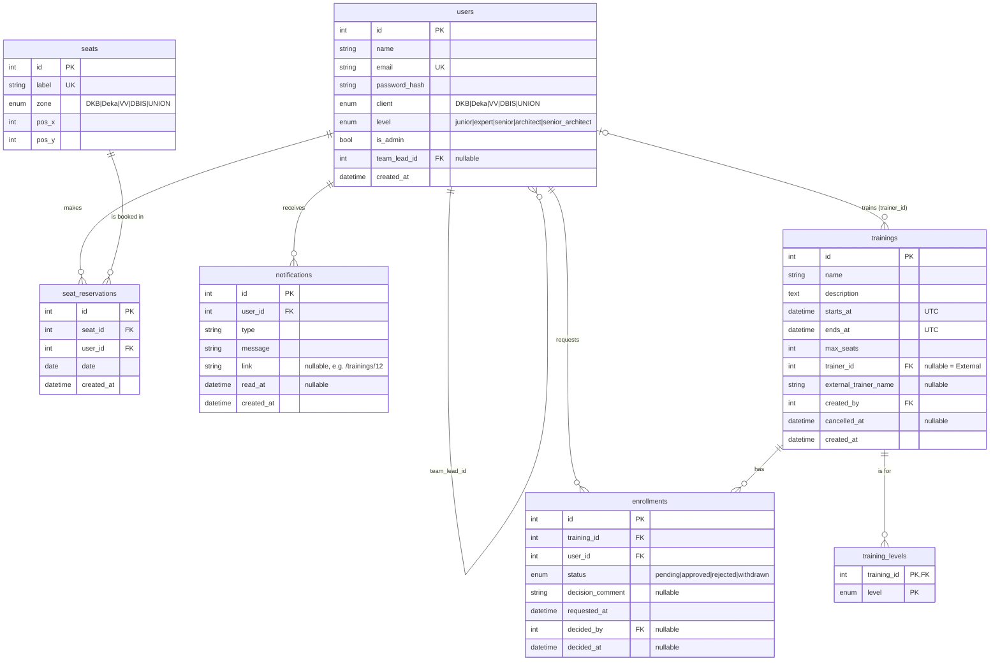
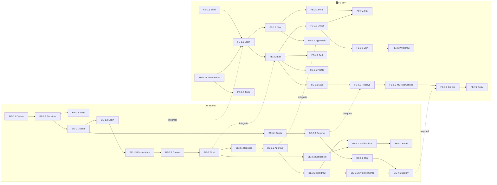

# Plan — Praying Mantis internal platform

> Draft for review, written 2026-09-25. Nothing here is decided until you agree with it.
> Anything marked **❓** is an open question, and anything marked **💡** is a recommendation you can override.

---

## 0. How to read this plan

**Team:** two developers.
- **BE dev**: backend and database (Python, FastAPI, SQLAlchemy, MySQL)
- **FE dev**: frontend (React, TypeScript, pnpm)

**Sections:**
1. **Section 1–2**: what we're building, and what we're *not* building.
2. **Section 3**: how two people split the work and still learn from each other.
3. **Section 4**: the proposed database model, with every change from your sketch explained. This is mostly BE work, but FE should read it too.
4. **Section 5**: decisions to make *before* coding, together.
5. **Section 6**: the work, feature by feature. Each feature has:
   - **🤝 Together: Think & Design**: a short joint session to agree the questions, the screens and the **API contract**
   - **⚙️ BE-x.y stories** for the backend developer
   - **🖥️ FE-x.y stories** for the frontend developer
   Every story lists its acceptance criteria, tasks, what it depends on, and **📚 Learn** (the concepts it is meant to teach).
6. **Section 7**: order and milestones, as two swimlanes (one per developer).
7. **Section 8**: all open questions in one list, to answer in one go.

---

## 1. Goal

One internal platform that brings existing company tools together. The first two features are ours:

| Feature | Owner | In scope? |
|---|---|---|
| Book trainings | us | ✅ |
| Reserve office seats | us | ✅ |
| Timesheets | other group | ❌ (a nav link at most) |
| Vacations | other group | ❌ (a nav link at most) |
| Expense sheets | nobody yet | ❌ |

The second goal matters just as much: **learn Python, FastAPI, MySQL (through SQLAlchemy) and React.** When a shortcut and a learning opportunity conflict, this plan leans toward learning unless the cost is large.

## 2. Out of scope (for now)

- Company SSO (Azure AD / Entra etc.). We build our own simple login first. See **D1**.
- Timesheets, vacations and expenses. The layout only leaves room for them.
- Mobile apps. The web app should still work on a phone screen.
- Real email delivery in production. Emails go to a local fake inbox (a stretch goal, **BE-4.2**).
- Deploying the backend. This is a later story (**BE-7.1**). Until then the GitHub Pages site runs on mocked data (see **D13**).

---

## 3. Working as a pair of specialists

### 3.1 The rhythm for each feature

1. **🤝 Together (30–60 min)**: go through the feature's 🧠 questions, sketch the screens, and **agree the API contract**: endpoints, request and response JSON, and error codes. Write the decisions into `decisions.md`. The contract is the promise between the two of you.
2. **Work in parallel**:
   - **BE** implements the contract, test-first for business rules. FastAPI's `/docs` page shows the contract live.
   - **FE** builds the screens against **mocked responses** that follow the contract (**D13**), so FE never waits for BE.
3. **🤝 Integrate (15–30 min)**: FE switches from mocks to the real API. Fix any mismatch, and whoever broke the contract fixes their side.
4. **🤝 Demo and reflect (10 min)**: click through the feature together. Each of you adds at least one entry to `learnings.md` under a topic heading (`## Python`, `## FastAPI`, `## SQLAlchemy`, `## MySQL`, `## React`, `## TypeScript`, …).

### 3.2 Learning from the other side

With a fixed split there's a risk that the BE dev never learns React and the FE dev never learns FastAPI. Three cheap ways to avoid that:
- **Cross-review every PR.** FE reviews BE's PRs and BE reviews FE's PRs. Reading code in a language you don't write every day is a very efficient way to learn it. Ask "why?" in review comments; answering them teaches the author too.
- **Explain your side in the demo.** Two minutes of "this is the interesting bit of my code" at every demo.
- **Optional swap stories.** Some small stories are marked **🔁 swap candidate**. If you want to, the *other* developer builds that one, with the owner as the helper.

### 3.3 Definition of Done

**BE story:**
- [ ] Matches the agreed contract (check it in `/docs`)
- [ ] Tests cover every business rule and error code
- [ ] New tables and columns come with an Alembic migration
- [ ] Seed data updated if the feature needs demo data
- [ ] Reviewed by FE and merged to `main`

**FE story:**
- [ ] Works against the real API (not just mocks) once the matching BE story is merged
- [ ] Loading, empty and error states are handled
- [ ] Works with the keyboard and at phone width
- [ ] `pnpm lint`, `pnpm build` and `pnpm test` pass
- [ ] Reviewed by BE and merged to `main`

**Both:** the decision is in `decisions.md` (if one was made), and there's at least one new `learnings.md` entry per feature.

---

## 4. Data model (mostly BE, read by FE)

### 4.1 Your sketch (summarized)

- **User**: name, email, client (same enum as seat zone), role (Junior/Expert/Senior/Architect/Senior Architect), isTeamLead, TeamLead → User
- **Training**: id, name, description, dateTime, maxSeats, Trainer (User or "External"), list of enrolled users
- **Seat**: id, zone (DKB, Deka, VV, DBIS, UNION)
- **ReservedSeat**: user, seat, date

It's a good start. Most of the changes below come from the **workflow** you described, which needs things the sketch doesn't store yet.

### 4.2 Suggested improvements

| # | Change | Why |
|---|---|---|
| 1 | **Replace "list of enrolled users" with an `enrollments` table** that has a `status` (pending / approved / rejected / withdrawn) | A relational database can't store a list in a column. A many-to-many relationship always needs a join table. On top of that, the team-lead approval flow needs a *status* per enrollment, plus who decided and when. |
| 2 | **Add skill levels to trainings** with a `training_levels` join table (training_id, level) | The workflow says a training has "the skill level (or multiple)", but the sketch has nowhere to store it. More than one level per training means another join table. |
| 3 | **Rename user `role` → `level`** | Web apps usually use "role" for *permissions* (admin, user). Seniority is a different thing, and keeping the names apart avoids confusion in the code. |
| 4 | **Add `is_admin` to users** | The workflow mentions a "privileged account" that creates trainings. Nothing in the sketch marks someone as privileged. |
| 5 | **Trainer: nullable `trainer_id` (FK → users); NULL means "External"**, plus an optional `external_trainer_name` | This matches "a user, or External". The optional name lets the UI show "External – Jane Doe" if you want. ❓ Do you want the external name, or just "External"? |
| 6 | **Drop `isTeamLead` and derive it** ("is anyone's `team_lead_id` pointing at me?") 💡 | Storing it creates two sources of truth that can disagree: `isTeamLead = false` while three people have you as their lead. ❓ Keep it only if someone should count as a team lead before having any reports. |
| 7 | **One shared `Client` enum** in Python, used by both `users.client` and `seats.zone` | You already said they're the same list, so define it once. |
| 8 | **Store training time as `starts_at` (UTC) plus `ends_at`** (or a duration) | The end time lets us show "09:00–12:00", tell when a training is *completed*, and later catch overlapping enrollments. Storing UTC and displaying local time is the standard way to avoid time-zone bugs. |
| 9 | **Add a map position to seats**: `label` ("DKB-07"), `pos_x`, `pos_y` | The seat map has to know where to draw each seat. |
| 10 | **Unique constraints on reservations**: (`seat_id`, `date`) and (`user_id`, `date`) | The database then guarantees a seat can't be double-booked, even if two people click at the same moment. ❓ The second constraint means one seat per person per day. Is that the rule? |
| 11 | **Add a `notifications` table** | The workflow sends notifications to team leads and users, and they need to be stored somewhere. |
| 12 | **Add `password_hash` to users** | Needed for login (**D1**). We never store plain passwords. |
| 13 | **Naming: snake_case, plural table names** (`users`, `seat_reservations`) | The usual Python/SQL convention. SQLAlchemy models stay singular (`User`, `SeatReservation`). |

### 4.3 Proposed schema



**Constraints worth writing down:**
- `enrollments`: UNIQUE (`training_id`, `user_id`), so a user can't request the same training twice
- `seat_reservations`: UNIQUE (`seat_id`, `date`) and UNIQUE (`user_id`, `date`)
- `trainings`: CHECK `max_seats > 0` and CHECK `ends_at > starts_at`

**Derived, not stored:**
- *Seats left* = `max_seats` − the number of approved enrollments (see **❓ Q7**, which asks whether pending ones count too)
- *Completed trainings* = the user's approved enrollments whose training has `ends_at` in the past and isn't cancelled
- *Is team lead* = at least one user has `team_lead_id` = this user

---

## 5. Up-front decisions (🤝 decide together)

These affect several stories, so decide them in the first session. Each has a recommendation, and the **Owner** column says who carries the decision out.

| # | Decision | Options | 💡 Recommendation | Owner |
|---|---|---|---|---|
| **D1** | How do users log in? | (a) email + password + JWT, (b) "pick a user" dev login, (c) company SSO | **(a)**. It teaches password hashing, tokens, FastAPI dependencies and protected routes. SSO is real-world but mostly configuration, so there's little to learn. | both |
| **D2** | Where does the frontend keep the token? | localStorage + `Authorization: Bearer` header, or an httpOnly cookie | **localStorage + Bearer** for now. Cookies are more secure, but they get tricky when the frontend (GitHub Pages) and backend live on different domains. Revisit in BE-7.1. | both |
| **D3** | Local MySQL | Docker Compose, or MySQL installed on each laptop | **Docker Compose**. One `docker compose up`, the same version for both of you, and easy to reset. FE needs it too, to run the real backend at integration time. | BE |
| **D4** | Database schema changes | Alembic migrations, or `Base.metadata.create_all()` | **Alembic**. `create_all` can't change an existing table, and migrations are a core skill worth learning. | BE |
| **D5** | Sync or async SQLAlchemy | sync (current code) or async | **Sync**. It's simpler to learn, and FastAPI runs sync endpoints in a thread pool, so it's fine for our load. | BE |
| **D6** | Frontend routing | React Router, TanStack Router | **React Router**. It's the most common, so it has the most tutorials. | FE |
| **D7** | Fetching data in React | plain `fetch` + `useEffect`, or TanStack Query | **Both, on purpose**: plain fetch in FE-1.1 so the basics and their pain points are clear (loading, errors, stale data), then introduce TanStack Query in FE-2.2 and compare. | FE |
| **D8** | Styling | plain CSS / CSS Modules, Tailwind, a component library (MUI, Mantine…) | **CSS Modules**. It's closest to "real" CSS, and a component library would hide much of what React is doing. ❓ FE dev's preference matters most here. | FE |
| **D9** | Forms | controlled components, or React Hook Form + Zod | **Controlled components first** (learn `useState`), then React Hook Form if the training form gets painful. | FE |
| **D10** | Testing | BE: pytest + FastAPI `TestClient` against a test MySQL database. FE: Vitest + React Testing Library. | **As listed.** BE tests matter most (the business rules live there), and FE tests are for key interactions only. | each |
| **D11** | API style | REST + JSON under an `/api` prefix | **REST**. FastAPI's automatic docs at `/docs` make exploring it easy. | both |
| **D12** | Git workflow | direct pushes to `main`, or a branch + PR per story | **A branch + PR per story**, reviewed by the other developer (section 3.2). | both |
| **D13** | How FE works before BE is ready | wait; hard-coded fake data in components; **MSW** (Mock Service Worker) | **MSW**. It intercepts `fetch` calls and answers with contract-shaped data, so FE code is identical with mocks or the real API. Bonus: the GitHub Pages site can run on mocks until the backend is deployed. | FE |
| **D14** | Keeping TypeScript types in sync with the API | write TS types by hand, or generate them from FastAPI's `/openapi.json` with `openapi-typescript` | **Generate them.** BE's Pydantic schemas become the single source of truth, and when BE changes a field, FE's build breaks where the change matters. It's also a nice lesson in how OpenAPI connects both worlds. | FE (BE keeps the schemas accurate) |

---

## 6. Features and stories

Numbering: **F** = feature, **BE-x.y** = backend story, **FE-x.y** = frontend story, where **x** is the feature number.

### F0 — Foundations

These stories don't depend on each other across roles, so both of you can start on day one.

#### 🤝 Together: Think & Design
- Go through decisions **D1–D14** (section 5).
- Agree the URL prefix `/api`, the error format (FastAPI's `{"detail": ...}`), and date formats (ISO 8601; datetimes in UTC with `Z`, plain dates as `YYYY-MM-DD`).
- Sketch the app shell together (it drives FE-0.1):
  ```
  ┌────────────────────────────────────────────────────┐
  │ 🦗 Praying Mantis   Trainings  Seats  Approvals  🔔 👤 │
  ├────────────────────────────────────────────────────┤
  │                                                    │
  │                  page content                      │
  │                                                    │
  └────────────────────────────────────────────────────┘
  ```

#### ⚙️ BE-0.1 Local database with Docker
**Story:** As the BE dev, I can start MySQL with one command, so we both have the same setup.

**Acceptance criteria**
- `docker compose up -d` in the repo root starts MySQL 8 with a named volume, so data survives restarts
- `backend/.env.example` matches the compose credentials
- `GET /health/db` returns `{"database": "ok"}`
- `CLAUDE.md` commands are updated. FE can follow them to run the backend locally.

**Tasks:** `docker-compose.yml` with a health check, update `.env.example`

**📚 Learn**
- Environment variables and `python-dotenv`
- The SQLAlchemy engine and connection URL
- What `pool_pre_ping` does

---

#### ⚙️ BE-0.2 Backend structure and migrations
**Story:** As the BE dev, I have a clear folder structure and database migrations, so adding features stays tidy.

**Acceptance criteria**
- Folder layout:
  ```
  backend/app/
    main.py          # creates the app, includes routers
    config.py        # settings (pydantic-settings)
    database.py
    models/          # SQLAlchemy models (tables)
    schemas/         # Pydantic models (API input/output = the contract)
    routers/         # one file per area: auth, trainings, seats, ...
    services/        # business rules, no HTTP concerns
  backend/alembic/   # migrations
  backend/tests/
  ```
- `alembic upgrade head` creates all tables in an empty database
- All routes live under `/api` (e.g. `/api/health/db`). Tell FE, because the hello call in `App.tsx` moves.

**Tasks:** add `alembic` and `pydantic-settings`, run `alembic init`, point `env.py` at `Base.metadata`, and move the existing routes into `routers/health.py`

**Depends on:** BE-0.1

**📚 Learn**
- `APIRouter` and `include_router`
- Pydantic `BaseModel` (API shape) vs SQLAlchemy models (database shape), and why `password_hash` lives in one and never the other
- Alembic `revision --autogenerate`, and why you always read the generated file

---

#### ⚙️ BE-0.3 Backend tests and CI
**Story:** As the BE dev, I can run automated tests against a real MySQL, locally and on every PR.

**Acceptance criteria**
- `pytest` runs against a separate test database, and each test starts clean
- A GitHub Actions job runs pytest on every PR, with a MySQL service container

**Tasks:** `tests/conftest.py` (create the test DB, override `get_db`, provide a `client` fixture), and a first test: `GET /api/` returns 200

🧠 **Think**
- A transaction rollback per test, or truncating tables? Discuss the trade-offs.
- Why not SQLite for tests? It behaves differently from MySQL (enums, constraints, locking).

**Depends on:** BE-0.2

**📚 Learn**
- pytest fixtures
- `app.dependency_overrides`
- Service containers in CI

---

#### 🖥️ FE-0.1 App shell and routing
**Story:** As a user, I see a consistent layout with navigation, so I can move between features.

**Acceptance criteria**
- The top bar from the sketch above. Nav links: Trainings, Seats, Profile, Approvals (all visible for now; FE-1.2 hides some). Leave room for future Timesheets and Vacations links.
- Routes with placeholder pages: `/login`, `/trainings`, `/trainings/:id`, `/seats`, `/profile`, `/approvals`, `/admin/trainings/new`
- Works at phone width
- Deep links survive a refresh on GitHub Pages

🧠 **Think**
- GitHub Pages doesn't support client-side routes: refreshing `/praying-mantis-1/trainings` gives a 404. Use the `404.html` redirect trick, or `HashRouter` (`/#/trainings`)? Pick one and record the decision.
- Styling (**D8**). Define a small palette and type scale as CSS variables.

**Tasks:** install React Router, create `src/pages/*` and `src/components/Layout.tsx`

**📚 Learn**
- Components and props
- `<Outlet />` layouts
- Client-side vs server-side routing

---

#### 🖥️ FE-0.2 API client, generated types and mocks
**Story:** As the FE dev, I have one place that talks to the API, types generated from the backend, and mocks, so I can build screens before the backend exists.

**Acceptance criteria**
- `src/api/client.ts` is the only code that knows `VITE_API_URL`. Later it adds the auth token and handles 401s.
- MSW set up: `VITE_USE_MOCKS=true` makes all API calls answer from `src/mocks/handlers.ts`
- `pnpm gen:api` generates `src/api/schema.d.ts` from `http://localhost:8000/openapi.json` (**D14**). Until BE has real endpoints, types can be written by hand and swapped later.
- The existing hello call uses the client, and works with mocks and with the real API

**Depends on:** BE-0.2 for the `/api` path. Use a mock until it's merged.

**📚 Learn**
- `fetch` and `async`/`await`
- TypeScript generics (`get<T>()`)
- How MSW intercepts requests
- What OpenAPI is

---

#### 🖥️ FE-0.3 Frontend tests and CI
**Story:** As the FE dev, I can run component tests locally and on every PR.

**Acceptance criteria**
- `pnpm test` runs Vitest with React Testing Library, and tests reuse the MSW handlers
- The PR workflow runs `pnpm lint`, `pnpm build` and `pnpm test`
- First test: the app shell renders the nav links

**📚 Learn**
- Testing Library's "test what the user sees" philosophy
- `jsdom`
- Using the same mocks in the browser and in tests

---

### F1 — Users and login

#### 🤝 Together: Think & Design
- Decide **D1** and **D2**. Token lifetime: 💡 8 hours, and refresh tokens are out of scope.
- Wrong email vs wrong password: 💡 the same generic "Invalid email or password".
- **❓ Q6:** Can admins approve enrollments? Who approves users without a team lead?
- **Contract:**
  ```
  POST /api/auth/login        {email, password}  → 200 {access_token, token_type: "bearer"}
                                                  → 401 {"detail": "Invalid email or password"}
  GET  /api/auth/me           (Bearer token)     → 200 {id, name, email, client, level,
                                                        is_admin, is_team_lead,
                                                        team_lead: {id, name} | null}
                                                  → 401 if missing, invalid or expired
  GET  /api/users?search=ana  (admin only)       → 200 [{id, name, email, level}]   # for the trainer picker in F2
  ```
- Login page wireframe: email, password, a submit button, and space for an error message

#### ⚙️ BE-1.1 Users in the database
**Story:** As the BE dev, I have realistic users in the database (every client and level, team leads, an admin), so both of us can build and test against real data.

**Acceptance criteria**
- `users` table matches section 4.3 (via a migration)
- `python -m app.seed` creates about 15 users: every level, every client, 2–3 team leads with reports, 1 admin, and 1 user without a team lead. Running it twice creates no duplicates.
- Seed logins are documented in `CLAUDE.md` (e.g. every password is `password123`, local only). FE needs these!

🧠 **Think**
- A MySQL `ENUM` column, or a VARCHAR with a Python enum? 💡 `Enum(..., native_enum=False)` stores a VARCHAR, because changing a MySQL ENUM later means rewriting the column.
- What happens to a lead's reports if the lead is deleted? 💡 `ON DELETE SET NULL`. Real systems usually deactivate users rather than delete them.

**Depends on:** BE-0.2

**📚 Learn**
- SQLAlchemy 2.0 `Mapped[...]` / `mapped_column`
- Self-referencing relationships
- Python `enum.Enum`
- Idempotent scripts

---

#### ⚙️ BE-1.2 Login API
**Story:** As an employee, I can exchange my email and password for a token, and the API knows who I am on every request.

**Acceptance criteria**
- `POST /api/auth/login` and `GET /api/auth/me` match the contract
- Passwords are hashed with `pwdlib[argon2]` (or bcrypt), and tokens are JWTs signed with a secret from `.env`
- A `get_current_user` dependency is reusable by every future endpoint
- Tests: correct login, wrong password, unknown email, missing token, expired token, garbage token

**Depends on:** BE-1.1

**📚 Learn**
- FastAPI `Depends` and `OAuth2PasswordBearer`
- What's inside a JWT, and why you never put secrets in it
- Hashing vs encryption

---

#### ⚙️ BE-1.3 Permissions
**Story:** As the system, I only let admins do admin things and only let team leads act on their own reports.

**Acceptance criteria**
- A `require_admin` dependency returns 403 for non-admins
- An `is_team_lead(user)` helper, and `is_team_lead` filled in on `/me`
- `GET /api/users?search=` works (admin only)
- Tests show the difference between 401 and 403

**Depends on:** BE-1.2

**📚 Learn**
- 401 vs 403
- Composing dependencies
- Why the backend must enforce every rule, even when the UI hides buttons

---

#### 🖥️ FE-1.1 Login, logout and protected pages
**Story:** As an employee, I can log in, stay logged in across refreshes, and log out.

**Acceptance criteria**
- The `/login` form shows the API's error message on a 401
- After login I go to `/trainings`, and the top bar shows my name
- Every other page redirects to `/login` when I'm not logged in
- Logout clears the token and goes to `/login`. Any 401 from the API does the same.
- Built with plain `fetch` + `useEffect` / `useState` (**D7**). Write down in `learnings.md` what felt clumsy.

**Tasks:** an `AuthContext` (`user`, `login()`, `logout()`), a `useAuth()` hook, a `<RequireAuth>` route wrapper, and token handling in `api/client.ts`

**Depends on:** FE-0.1, FE-0.2. Mocks until BE-1.2 is merged.

**📚 Learn**
- React Context
- Custom hooks
- Controlled inputs
- Form submit handling
- Where to store a token, and the risks of each option (**D2**)

---

#### 🖥️ FE-1.2 Role-aware navigation 🔁 swap candidate
**Story:** As a user, I only see the navigation that applies to me.

**Acceptance criteria**
- "Approvals" only shows when `is_team_lead` is true, and "New training" only when `is_admin` is true
- Visiting an admin page as a non-admin shows a friendly "Not allowed" page

**Depends on:** FE-1.1

**📚 Learn**
- Conditional rendering
- Why hiding UI is only a convenience, not security (the backend enforces it, see BE-1.3)

---

### F2 — Trainings

#### 🤝 Together: Think & Design
- Plain-text descriptions for now? 💡 Yes, no Markdown.
- Validation lives on **both** sides: BE is the source of truth, and FE gives fast feedback. Agree the rules once:
  - required fields
  - end after start
  - start in the future
  - max seats ≥ 1
  - at least one level
  - trainer XOR external
- Time zones: FE converts the local time from the form into UTC before sending, and back to local time for display.
- **❓ Q9:** Can users see trainings for other levels? 💡 No.
- Soft delete for cancelling (`cancelled_at`)? 💡 Yes.
- **Contract:**
  ```
  POST  /api/trainings            (admin)  body: TrainingCreate → 201 TrainingRead | 422 validation errors
  PATCH /api/trainings/{id}       (admin)  body: partial TrainingCreate → 200 TrainingRead
  POST  /api/trainings/{id}/cancel (admin)                      → 200 TrainingRead
  GET   /api/trainings            ?level=junior (admin only filter) → 200 [TrainingSummary]
  GET   /api/trainings/{id}                                     → 200 TrainingRead | 404
  ```
  ```json
  // TrainingCreate
  { "name": "Intro to FastAPI", "description": "…",
    "starts_at": "2026-10-14T09:00:00Z", "ends_at": "2026-10-14T12:00:00Z",
    "max_seats": 12, "trainer_id": 7, "external_trainer_name": null,
    "levels": ["junior", "expert"] }

  // TrainingSummary (TrainingRead adds "description")
  { "id": 12, "name": "Intro to FastAPI",
    "starts_at": "…", "ends_at": "…", "levels": ["junior", "expert"],
    "trainer": {"id": 7, "name": "Ana Silva"} | null,
    "external_trainer_name": null,
    "max_seats": 12, "seats_left": 4, "cancelled": false,
    "my_enrollment_status": null | "pending" | "approved" | "rejected" | "withdrawn" }
  ```
- Wireframes: the create form, and the list card:
  ```
  ┌──────────────────────────────────────────┐
  │ Intro to FastAPI              Pending ⏳ │
  │ Tue 14 Oct · 09:00–12:00 · Ana Silva     │
  │ Junior, Expert · 4 of 12 seats left      │
  └──────────────────────────────────────────┘
  ```

#### ⚙️ BE-2.1 Create trainings
**Story:** As an admin, I can create a training through the API with all its details and levels.

**Acceptance criteria**
- `Training` and `TrainingLevel` models plus a migration, matching section 4.3
- `POST /api/trainings` matches the contract, is admin-only, and enforces every agreed validation rule with Pydantic validators
- Seed adds about 8 trainings (past, future, cancelled, full, different levels, external trainer)
- A test for every validation rule

**Depends on:** BE-1.3

**📚 Learn**
- `@field_validator` and `@model_validator`
- FastAPI's 422 error format
- Join tables in SQLAlchemy

---

#### ⚙️ BE-2.2 List and read trainings
**Story:** As an employee, I can get the upcoming trainings for my level, with seats left and my own status.

**Acceptance criteria**
- `GET /api/trainings` for employees: upcoming, not cancelled, one of the training's levels = my level, sorted by date. Admins get everything, with an optional `?level=` filter.
- `seats_left` and `my_enrollment_status` are computed **in SQL** (a join or subquery with `COUNT`), not in a Python loop
- `GET /api/trainings/{id}` returns 404 for unknown IDs and for trainings outside my level (unless I'm an admin)
- `my_enrollment_status` is always `null` until F3 adds enrollments (the column is ready)

**Depends on:** BE-2.1

**📚 Learn**
- SQL `JOIN`, `GROUP BY` and subqueries in SQLAlchemy
- **The N+1 problem**: turn on `echo=True` and count the queries

---

#### ⚙️ BE-2.3 Edit and cancel trainings
**Story:** As an admin, I can fix a training's details or cancel it.

**Acceptance criteria**
- `PATCH` only changes the fields that were sent (`model_dump(exclude_unset=True)`)
- `max_seats` can't drop below the current number of approved enrollments (409)
- Cancel sets `cancelled_at`, and cancelled trainings can't be edited again
- Notifying enrolled users happens in BE-4.1 (leave a `# TODO` hook)

**Depends on:** BE-2.2

**📚 Learn**
- PATCH vs PUT
- Soft deletes

---

#### 🖥️ FE-2.1 Create-training form
**Story:** As an admin, I can create a training through a form, and I see validation errors next to the right field.

**Acceptance criteria**
- `/admin/trainings/new` fields: name, description (multi-line), start and end (`datetime-local`), trainer (a searchable user picker **or** an "External" checkbox with an optional name), levels (multi-select), max seats
- Client-side validation for the agreed rules. Server 422 errors are also mapped onto fields.
- Local time → UTC conversion on submit
- On success, redirect to `/trainings/:id`

**Depends on:** FE-1.2. Mocks until BE-2.1 is merged.

**📚 Learn**
- Controlled forms with many fields
- Debounced search input
- `Date` and time-zone pitfalls
- Showing server errors next to fields

---

#### 🖥️ FE-2.2 Training list page
**Story:** As an employee, I see the upcoming trainings for my level as cards.

**Acceptance criteria**
- `/trainings` shows `TrainingCard`s as in the wireframe, with a `StatusBadge` for `my_enrollment_status`
- A level filter for admins
- Loading, empty ("No upcoming trainings for your level yet") and error states
- **Introduce TanStack Query here** (**D7**) and refactor FE-1.1's `/me` call to use it. Note the difference in `learnings.md`.

**Depends on:** FE-1.1. Mocks until BE-2.2 is merged.

**📚 Learn**
- `useQuery`, query keys and caching
- Splitting UI into small components
- Formatting dates with `Intl.DateTimeFormat`

---

#### 🖥️ FE-2.3 Training detail page
**Story:** As an employee, I can open a training and read the full description.

**Acceptance criteria**
- `/trainings/:id` shows everything from the card, plus the description
- A "Not found" page on 404
- Placeholder area for the join button (F3)

**Depends on:** FE-2.2

**📚 Learn**
- `useParams`
- Deriving UI from data instead of copying it into state

---

#### 🖥️ FE-2.4 Edit and cancel training
**Story:** As an admin, I can edit a training in the same form, or cancel it.

**Acceptance criteria**
- `/admin/trainings/:id/edit` reuses the FE-2.1 form, pre-filled, and sends only the changed fields
- A "Cancel training" button with a confirmation dialog. Cancelled trainings show a "Cancelled" badge everywhere.

**Depends on:** FE-2.1, FE-2.3. Mocks until BE-2.3 is merged.

**📚 Learn**
- Reusing a component for create and edit
- An accessible confirmation dialog (`<dialog>`)

---

### F3 — Enrollment and approval

#### 🤝 Together: Think & Design
- **❓ Q7:** Do pending requests take up a seat? 💡 No, only approved ones count, and approval checks capacity again.
- **❓ Q8:** Can a rejected user request again? 💡 No.
- Withdraw allowed while pending or approved, before the training starts? 💡 Yes.
- Users without a team lead: follow the answer to **Q6**.
- The status flow, drawn together:
  ```
  (none) ──request──▶ pending ──approve──▶ approved
                        │  └────reject───▶ rejected
                        └──withdraw──▶ withdrawn ◀──withdraw── approved
  ```
- **Contract:**
  ```
  POST /api/trainings/{id}/enrollments   → 201 EnrollmentRead
                                         → 403 wrong level · 409 already requested | full | past | cancelled
  GET  /api/approvals                    → 200 [ {enrollment: EnrollmentRead, user: {id,name}, training: TrainingSummary} ]
  POST /api/enrollments/{id}/approve     → 200 EnrollmentRead · 403 not your report · 409 full | not pending
  POST /api/enrollments/{id}/reject      body {comment?} → 200 EnrollmentRead
  POST /api/enrollments/{id}/withdraw    → 200 EnrollmentRead · 403 not yours · 409 already started
  ```
  Every 409 response uses one agreed shape, so FE can show a friendly message: `{"detail": {"code": "training_full", "message": "This training is full"}}`
- Wireframe: the approvals table (person, training, date, seats left, Approve/Reject)

#### ⚙️ BE-3.1 Request to join
**Story:** As an employee, I can request a seat in a training, and the rules are enforced.

**Acceptance criteria**
- `Enrollment` model plus a migration (UNIQUE `training_id` + `user_id`)
- An `enrollment_service.request(user, training)` function holds **all** the rules, and the router only maps errors to status codes
- `my_enrollment_status` and `seats_left` from BE-2.2 now use real data
- **TDD:** write one test per acceptance rule *before* the code

**Depends on:** BE-2.2

**📚 Learn**
- A service layer
- Domain exceptions → HTTP errors
- Writing tests first

---

#### ⚙️ BE-3.2 Approve and reject
**Story:** As a team lead, I can list and decide my reports' pending requests.

**Acceptance criteria**
- `/api/approvals` only returns *my* reports' pending enrollments
- Approving locks the training row (`with_for_update()`), recounts approved enrollments and refuses when full. This all happens in one transaction.
- `decided_by`, `decided_at` and `decision_comment` are stored
- Tests: approving someone who isn't my report (403), approving when full (409), approving twice (409), plus a test that simulates two leads approving the last seat

**Depends on:** BE-3.1

**📚 Learn**
- Transactions and isolation levels
- `SELECT … FOR UPDATE`
- Row-level authorization (checking *whose* record it is, not just the user's role)

---

#### ⚙️ BE-3.3 Withdraw
**Story:** As an employee, I can withdraw my request or enrollment.

**Acceptance criteria**
- Only the owner can withdraw, only from pending or approved, only before `starts_at`
- Seats left goes up after withdrawing an approved enrollment

**Depends on:** BE-3.2

**📚 Learn**
- Status transitions as a small state machine: one function decides which moves are allowed

---

#### 🖥️ FE-3.1 Request-to-join button
**Story:** As an employee, I can request to join from the detail page and immediately see my new status.

**Acceptance criteria**
- The button on `/trainings/:id` reflects the state: "Request to join" / "Pending approval" (disabled) / "Enrolled ✓" / "Rejected" / "Full" / "Cancelled"
- A `useMutation` that invalidates the list and detail queries, so the badge updates everywhere
- 409 and 403 messages come from the error `code` and are shown clearly

**Depends on:** FE-2.3. Mocks until BE-3.1 is merged.

**📚 Learn**
- `useMutation` and cache invalidation
- Mapping error codes to UI messages

---

#### 🖥️ FE-3.2 Approvals page
**Story:** As a team lead, I see pending requests from my reports and approve or reject them.

**Acceptance criteria**
- `/approvals` table as in the wireframe, with an empty state ("Nothing to approve 🎉")
- Reject opens a small dialog with an optional comment
- Rows disappear after a decision without a reload. If the training was full, the row shows why.

**Depends on:** FE-1.2. Mocks until BE-3.2 is merged.

**📚 Learn**
- Tables in React (keys!)
- Optimistic updates vs refetching: try both and compare

---

#### 🖥️ FE-3.3 Withdraw button 🔁 swap candidate
**Story:** As an employee, I can withdraw from the detail page.

**Acceptance criteria**
- A "Withdraw" button while pending or approved and not yet started, with a confirmation step

**Depends on:** FE-3.1. Mocks until BE-3.3 is merged.

**📚 Learn**
- Reusing the mutation and confirmation patterns you already built

---

### F4 — Notifications

#### 🤝 Together: Think & Design
- Live updates: 💡 FE polls every 30 s. Server-Sent Events or WebSockets could be a later learning spike.
- Which events create a notification?
  - new request → team lead
  - approved or rejected → employee
  - withdrawal of an approved enrollment → team lead
  - training cancelled or changed → everyone pending or approved
- **Contract:**
  ```
  GET  /api/notifications?limit=20        → 200 {unread_count, items: [{id, type, message, link, read, created_at}]}
  POST /api/notifications/{id}/read       → 204
  POST /api/notifications/read-all        → 204
  ```
- Wireframe: the bell with a badge, and a dropdown list with unread items in bold

#### ⚙️ BE-4.1 Notification storage and triggers
**Story:** As a user, I get a notification whenever something happens that I need to know about.

**Acceptance criteria**
- `Notification` model plus a migration, and the endpoints match the contract
- `notification_service.notify(...)` is called from the enrollment and training services **inside the same transaction** as the action, so an approval can never be saved without its notification
- Fills in the `# TODO` from BE-2.3 (cancel and change notifications)
- Tests check that each event creates the right notification for the right person

**Depends on:** BE-3.3, BE-2.3

**📚 Learn**
- Side effects inside a transaction
- Keeping services small and composable

---

#### ⚙️ BE-4.2 Email notifications (stretch)
**Story:** As a team lead, I also get an email for approval requests.

**Acceptance criteria**
- Mailpit is added to Docker Compose. Local emails show up in its web inbox.
- Emails are sent through `BackgroundTasks` after the response, so a slow mail server never slows or breaks the API

**Depends on:** BE-4.1

**📚 Learn**
- `BackgroundTasks`
- SMTP basics
- Why side effects that can fail belong outside the request

---

#### 🖥️ FE-4.1 Notification bell
**Story:** As a user, I see a bell with an unread count and can open, read and follow notifications.

**Acceptance criteria**
- The bell in the top bar shows the unread count and polls every 30 s (`refetchInterval`)
- The dropdown lists the latest 20. Clicking one marks it read and navigates to its `link`.
- "Mark all as read"
- The dropdown is keyboard-accessible: focus moves into it, and Escape closes it

**Depends on:** FE-0.1, FE-2.2 (TanStack Query). Mocks until BE-4.1 is merged.

**📚 Learn**
- Polling with TanStack Query
- Click-outside and focus management
- Accessible menus

---

### F5 — Profile

#### 🤝 Together: Think & Design
- **❓ Q10:** "Completed" = approved + training ended + not cancelled, with no attendance check? 💡 Yes.
- **❓ Q15:** Can users edit their own level or client? 💡 No, admins only (level decides which trainings you see).
- **Contract:**
  ```
  GET /api/me/enrollments  → 200 {upcoming: [TrainingSummary], pending: [TrainingSummary], completed: [TrainingSummary]}
  ```
- Wireframe: a profile header card plus three sections

#### ⚙️ BE-5.1 My enrollments endpoint
**Story:** As an employee, I can get my upcoming, pending and completed trainings in one call.

**Acceptance criteria**
- Matches the contract, reusing the query building from BE-2.2
- Tests use a **frozen clock** so "completed" vs "upcoming" is deterministic

**Depends on:** BE-3.3

**📚 Learn**
- Reusing query fragments
- Controlling "now" in tests (`time-machine`, or injecting a clock)

---

#### 🖥️ FE-5.1 Profile page 🔁 swap candidate
**Story:** As an employee, my profile shows my details and my trainings.

**Acceptance criteria**
- `/profile` shows name, email, client, level and team lead (from `/me`), then Upcoming, Pending and Completed sections reusing `TrainingCard`
- Empty states for each section

**Depends on:** FE-2.2. Mocks until BE-5.1 is merged.

**📚 Learn**
- Composition: building a page from existing components

---

### F6 — Seat reservations

#### 🤝 Together: Think & Design
- **❓ Q11:** Is there a real floor plan? How many seats per zone and floors? 💡 A fake grid on one floor, about 10 seats per zone, as grid coordinates (not pixels).
- **❓ Q12:** Can people see *who* took a seat? 💡 Yes, name only.
- **❓ Q14:** How far ahead can seats be booked, and are weekends allowed? 💡 2 weeks, no weekends.
- **❓ Q3:** One seat per person per day? 💡 Yes. Clicking another seat *moves* your reservation.
- Colours: **free = white, taken = red** (from your spec), **mine = green**, **other client = greyed out**. Colour alone isn't accessible, so also use an icon or pattern and a text label.
- The map is drawn with CSS Grid made of `<button>`s (accessible by default) rather than SVG.
- **Contract:**
  ```
  GET    /api/seats?date=2026-10-14   → 200 [{id, label, zone, pos_x, pos_y,
                                               status: "free"|"taken"|"mine",
                                               taken_by: {id, name} | null,
                                               bookable: bool}]
                                      → 422 past / too far / weekend
  POST   /api/reservations  {seat_id, date} → 201 ReservationRead
                                      → 403 other client · 409 {code: "seat_taken"} · 422 bad date
                                        (if I already had a seat that day, it's moved)
  GET    /api/reservations/me         → 200 [ReservationRead]   # upcoming only
  DELETE /api/reservations/{id}       → 204 · 403 not yours · 409 in the past
  ```
- Map wireframe:
  ```
   Date: [ 14 Oct 2026 ▾ ]        ⬜ free  🟥 taken  🟩 mine  ▒ other client

   ┌─ DKB ──────────────┐  ┌─ Deka ─────────────┐
   │ ⬜ ⬜ 🟥 ⬜          │  │ ▒ ▒ ▒ ▒            │
   │ ⬜ 🟩 🟥 ⬜          │  │ ▒ ▒ ▒ ▒            │
   └────────────────────┘  └────────────────────┘
  ```

#### ⚙️ BE-6.1 Seats and office layout
**Story:** As the BE dev, I have every office seat in the database with its zone and grid position.

**Acceptance criteria**
- `Seat` model plus a migration. Seed data follows the agreed layout.
- Share the seed layout (a small table or picture) with FE, so the mocks look the same

**Depends on:** BE-1.1

**📚 Learn**
- Modelling physical things
- Seed data as code

---

#### ⚙️ BE-6.2 Seat map endpoint
**Story:** As an employee, I can get every seat's status for a given day.

**Acceptance criteria**
- `GET /api/seats?date=` matches the contract, using **one** query: seats `LEFT JOIN` reservations for that date
- `bookable` = free, the zone matches my client, and the date is valid
- Date rules (past, too far ahead, weekend) return 422

**Depends on:** BE-6.1, BE-6.3 (for the reservations table). The endpoint can ship first with everything free.

**📚 Learn**
- `LEFT JOIN`
- Query parameters and validation of dates

---

#### ⚙️ BE-6.3 Reserve, move and cancel reservations
**Story:** As an employee, I can reserve a seat, move it, see my reservations and cancel them.

**Acceptance criteria**
- `SeatReservation` model plus a migration, with both UNIQUE constraints
- `POST` inserts and **catches `IntegrityError`** to return 409 `seat_taken` when someone was faster. If I already have a seat that day, the old one is deleted and the new one created in one transaction.
- `GET /me` and `DELETE` match the contract, with owner-only checks
- Tests cover every rule, including "two users, same seat, same day"

**Depends on:** BE-6.1

🧠 **Think:** compare this approach (a unique constraint, *optimistic*) with BE-3.2's row lock (*pessimistic*). Why does each fit its case? That's a great `learnings.md` entry.

**📚 Learn**
- Unique constraints as the source of truth
- `IntegrityError`
- Optimistic vs pessimistic concurrency

---

#### 🖥️ FE-6.1 Seat map
**Story:** As an employee, I can pick a date and see the office map with each seat's status.

**Acceptance criteria**
- `/seats` has a date picker (default today, respecting the agreed date rules) and a legend
- `SeatMap` and `Seat` components laid out on a CSS Grid from `pos_x`/`pos_y`, grouped by zone
- Colours and icons as agreed. Hovering or focusing a taken seat shows who took it.
- Keyboard: Tab through seats, with a useful `aria-label` like "DKB-03, taken by Ana Silva"
- The query is keyed by date, so switching back to a date you've seen is instant

**Depends on:** FE-2.2 (TanStack Query). Mocks until BE-6.2 is merged.

**📚 Learn**
- CSS Grid
- Mapping data to layout
- `aria-label` / `aria-pressed`
- Query keys with parameters

---

#### 🖥️ FE-6.2 Reserve a seat
**Story:** As an employee, I click a free seat in my zone, confirm, and it becomes mine.

**Acceptance criteria**
- Clicking a bookable seat opens "Reserve DKB-03 for Tue 14 Oct?". If I already have a seat that day, it says "Move your reservation from DKB-01 to DKB-03?".
- On success the map updates (invalidate that date's query)
- On 409 `seat_taken`: "Sorry, this seat was just taken", then the map refreshes

**Depends on:** FE-6.1. Mocks until BE-6.3 is merged.

**📚 Learn**
- Mutations with parameters
- Handling race conditions gracefully in the UI

---

#### 🖥️ FE-6.3 My reservations 🔁 swap candidate
**Story:** As an employee, I see my upcoming reservations and can cancel one.

**Acceptance criteria**
- A "My reservations" list next to or under the map, sorted by date
- Cancel with confirmation. The seat turns white on the map for that date.

**Depends on:** FE-6.2

**📚 Learn**
- Invalidating related queries (the list *and* the map for that date)

---

### F7 — Going live

#### 🤝 Together: Think & Design
- **❓ Q13:** Where may the backend and database be hosted? Company infrastructure (Azure?), or a platform like Render, Railway or Fly.io plus managed MySQL? This is probably a company policy question: real employee data must not go to random hosts.
- Revisit **D2** once the domains are known. Or move the frontend to the same host as the backend and avoid CORS entirely?

#### ⚙️ BE-7.1 Deploy the backend and database
**Story:** As a colleague, I can use the live site with a real backend.

**Acceptance criteria**
- A backend `Dockerfile` and a deploy workflow. Migrations run on deploy.
- Secrets (DB password, JWT secret) live in the host's secret store, never in git
- `CORS_ORIGINS` includes the frontend's real origin

**📚 Learn**
- Containers
- Environment-specific config
- Secrets management

---

#### 🖥️ FE-7.1 Point the live site at the backend
**Story:** As a colleague, the GitHub Pages site talks to the real backend instead of mocks.

**Acceptance criteria**
- The `VITE_API_URL` repo variable is set, and `VITE_USE_MOCKS` is off for production builds
- A smoke test on the live URL: log in, open trainings, open seats

**Depends on:** BE-7.1

---

#### 🖥️ FE-7.2 Accessibility and responsive pass
**Story:** As any user, including keyboard and screen-reader users and phone users, I can use every feature.

**Acceptance criteria**
- Every page works with the keyboard alone
- Lighthouse accessibility score ≥ 90 on the main pages
- Layouts work at 375 px width

**📚 Learn**
- Semantic HTML
- ARIA only when needed
- Responsive CSS

---

## 7. Order and milestones

### 7.1 Two swimlanes

Each row is roughly one feature. 🤝 marks the joint sessions. FE always works against mocks first, so neither of you has to wait for the other.

| Milestone | 🤝 Together | ⚙️ BE dev | 🖥️ FE dev | You can demo… |
|---|---|---|---|---|
| **M1: Walking skeleton** | Decisions D1–D14, F0 and F1 contracts | BE-0.1 → BE-0.2 → BE-0.3 → BE-1.1 → BE-1.2 | FE-0.1 → FE-0.2 → FE-0.3 → FE-1.1 | Logging in with a seeded user and clicking through empty pages |
| **M2: Trainings** | F2 contract | BE-1.3 → BE-2.1 → BE-2.2 | FE-1.2 → FE-2.1 → FE-2.2 → FE-2.3 | Admin creates a training, and an employee sees it in the list |
| **M3: Enrollment** | F3 contract | BE-3.1 → BE-3.2 → BE-3.3 → BE-2.3 | FE-3.1 → FE-3.2 → FE-3.3 → FE-2.4 | Request → lead approves → status updates; edit or cancel a training |
| **M4: Seats** | F6 contract | BE-6.1 → BE-6.3 → BE-6.2 | FE-6.1 → FE-6.2 → FE-6.3 | Picking a day, reserving, moving and cancelling a seat |
| **M5: Complete loop** | F4 and F5 contracts | BE-4.1 → BE-5.1 → (BE-4.2) | FE-4.1 → FE-5.1 | Notifications and profile |
| **M6: Live** | F7 hosting decision | BE-7.1 | FE-7.1 → FE-7.2 | A real URL colleagues can use |

### 7.2 Workload check

| | ⚙️ BE | 🖥️ FE |
|---|---|---|
| Stories | 19 (1 stretch) | 19 |
| Heaviest | BE-1.2 login, BE-2.2 queries, BE-3.2 locking, BE-6.3 concurrency | FE-0.2 mocks and types, FE-1.1 auth, FE-2.1 form, FE-6.1 seat map |

The split is roughly even. If one of you gets ahead, pick a 🔁 swap candidate from the other lane instead of starting the next milestone alone. It's the best way to learn the other half of the stack.

### 7.3 Dependencies across the two lanes



Solid arrows = must happen first, within one lane. Dotted arrows = FE can build earlier on mocks, but switches to the real API once that BE story is merged. Only **FE-7.1** truly waits for BE.

---

## 8. Open questions — please answer

| # | Question | 💡 Default if you don't answer |
|---|---|---|
| Q1 | Change 5: show an external trainer's name, or only "External"? | Optional name, shown when given |
| Q2 | Change 6: drop `isTeamLead` and derive it from having reports? | Derive it |
| Q3 | Change 10: at most one seat per person per day? | Yes, and clicking another seat moves it |
| Q4 | D1: email + password login instead of SSO for now? | Yes |
| Q5 | D8: styling approach? (the FE dev decides) | CSS Modules |
| Q6 | F1: can admins approve enrollments? Who approves users without a team lead? | Admins can; users without a lead go to admins |
| Q7 | F3: do pending requests take up a seat? | No, only approved ones |
| Q8 | F3: can a rejected user request the same training again? | No |
| Q9 | F2: can users see trainings for other levels? | No |
| Q10 | F5: "completed" = approved + date passed (no attendance check)? | Yes |
| Q11 | F6: is there a real floor plan? How many seats per zone, and how many floors? | A fake grid on one floor, about 10 seats per zone |
| Q12 | F6: can people see *who* reserved a seat? | Yes, name only |
| Q13 | F7: where may the backend be hosted? Any company rules on employee data? | Decide at M6 |
| Q14 | F6: how far ahead can seats be booked? Weekends allowed? | 2 weeks, no weekends |
| Q15 | F5: can users edit their own level or client? | No, admins only |
| Q16 | Does the level order Junior → Expert → Senior → Architect → Senior Architect match the company ladder? (It matters if we ever show "this level and above".) | Yes, as written |
| Q17 | D13/D14: are you both happy with MSW mocks and generated TypeScript types? They add some setup in F0 but remove a lot of waiting later. | Yes |
