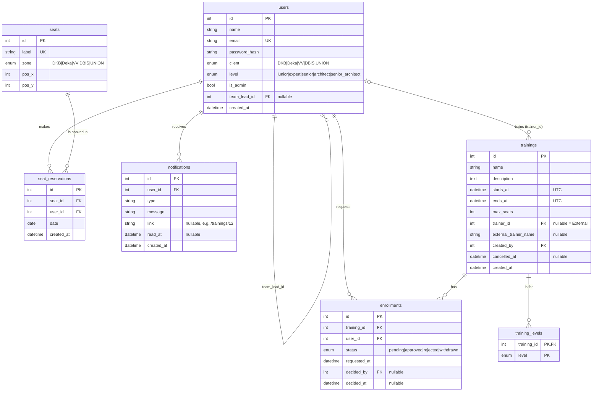
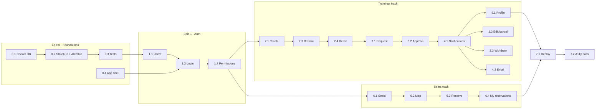

# Plan — Praying Mantis internal platform

> Draft for review, written 2026-09-25. Nothing here is decided until you agree with it.
> Anything marked **❓** is an open question, and anything marked **💡** is a recommendation you can override.

---

## 0. How to read this plan

1. **Section 1–2**: what we're building, and what we're *not* building.
2. **Section 3**: the learning approach, i.e. how each story is set up so we actually learn the stack.
3. **Section 4**: the proposed database model, with every change from your sketch explained.
4. **Section 5**: decisions to make *before* coding (the big "think" items).
5. **Section 6**: user stories, grouped into epics. Every story has the same shape:
   - **Story**: who wants what, and why
   - **Acceptance criteria**: how we know it's done
   - **🧠 Think**: questions to discuss before starting
   - **🎨 Design**: UI sketches, API shape, data changes
   - **⚙️ Backend**: FastAPI / SQLAlchemy / MySQL tasks
   - **🖥️ Frontend**: React tasks
   - **📚 Learn**: the concepts this story is meant to teach
6. **Section 7**: suggested order and dependencies.
7. **Section 8**: all open questions in one list, to answer in one go.

---

## 1. Goal

One internal platform that brings existing company tools together. The first two features are ours:

| Feature | Owner | In scope? |
|---|---|---|
| Book trainings | us | ✅ |
| Reserve office seats | us | ✅ |
| Timesheets | other group | ❌ (a nav link at most) |
| Vacations | other group | ❌ (a nav link at most) |
| Expense sheets | nobody yet | ❌ |

The second goal matters just as much: **learn Python, FastAPI, MySQL (through SQLAlchemy) and React.** When a shortcut and a learning opportunity conflict, this plan leans toward learning unless the cost is large.

## 2. Out of scope (for now)

- Company SSO (Azure AD / Entra etc.). We build our own simple login first. See **D1**.
- Timesheets, vacations and expenses. The layout only leaves room for them.
- Mobile apps. The web app should still work on a phone screen.
- Real email delivery in production. Emails go to a local fake inbox (a stretch goal, **US-4.2**).
- Deploying the backend. This is a later epic (**US-7.1**). Until then the GitHub Pages site shows "Backend unreachable".

---

## 3. Learning approach

**Each story is a vertical slice.** It touches the database, the API and the UI, so everyone sees the whole stack early instead of one person only ever writing CSS.

**Suggested rhythm for a dojo session:**

1. **Think (10–15 min)**: read the story and go through its 🧠 questions. Record any decision in `decisions.md`.
2. **Design (10–15 min)**: sketch the screen on paper or a whiteboard, and write the API endpoint(s) and JSON shape down before coding.
3. **Build**: backend first, test-first where there are business rules (TDD fits rules like "can't book a taken seat" very well). Then the frontend against the real API.
4. **Reflect (5 min)**: add what you learned to `learnings.md` under a topic heading (`## Python`, `## FastAPI`, `## SQLAlchemy`, `## MySQL`, `## React`, `## TypeScript`, …).

**Rotate roles.** Whoever drove the backend last time drives the frontend next time.

**Definition of Done**, for every story:
- [ ] Acceptance criteria met and demoed in the browser
- [ ] Backend tests cover the business rules
- [ ] New tables and columns come with an Alembic migration
- [ ] `pnpm lint` and `pnpm build` pass, and backend tests pass
- [ ] Any decision made is in `decisions.md`
- [ ] At least one entry added to `learnings.md`
- [ ] Merged to `main` through a PR that someone else reviewed

---

## 4. Data model

### 4.1 Your sketch (summarized)

- **User**: name, email, client (same enum as seat zone), role (Junior/Expert/Senior/Architect/Senior Architect), isTeamLead, TeamLead → User
- **Training**: id, name, description, dateTime, maxSeats, Trainer (User or "External"), list of enrolled users
- **Seat**: id, zone (DKB, Deka, VV, DBIS, UNION)
- **ReservedSeat**: user, seat, date

It's a good start. Most of the changes below come from the **workflow** you described, which needs things the sketch doesn't store yet.

### 4.2 Suggested improvements

| # | Change | Why |
|---|---|---|
| 1 | **Replace "list of enrolled users" with an `enrollments` table** that has a `status` (pending / approved / rejected / withdrawn) | A relational database can't store a list in a column. A many-to-many relationship always needs a join table. On top of that, the team-lead approval flow needs a *status* per enrollment, plus who decided and when. |
| 2 | **Add skill levels to trainings** with a `training_levels` join table (training_id, level) | The workflow says a training has "the skill level (or multiple)", but the sketch has nowhere to store it. More than one level per training means another join table. |
| 3 | **Rename user `role` → `level`** | Web apps usually use "role" for *permissions* (admin, user). Seniority is a different thing, and keeping the names apart avoids confusion in the code. |
| 4 | **Add `is_admin` to users** | The workflow mentions a "privileged account" that creates trainings. Nothing in the sketch marks someone as privileged. |
| 5 | **Trainer: nullable `trainer_id` (FK → users); NULL means "External"**, plus an optional `external_trainer_name` | This matches "a user, or External". The optional name lets the UI show "External – Jane Doe" if you want. ❓ Do you want the external name, or just "External"? |
| 6 | **Drop `isTeamLead` and derive it** ("is anyone's `team_lead_id` pointing at me?") 💡 | Storing it creates two sources of truth that can disagree: `isTeamLead = false` while three people have you as their lead. ❓ Keep it only if someone should count as a team lead before having any reports. |
| 7 | **One shared `Client` enum** in Python, used by both `users.client` and `seats.zone` | You already said they're the same list, so define it once. |
| 8 | **Store training time as `starts_at` (UTC) plus `ends_at`** (or a duration) | The end time lets us show "09:00–12:00", tell when a training is *completed*, and later catch overlapping enrollments. Storing UTC and displaying local time is the standard way to avoid time-zone bugs. |
| 9 | **Add a map position to seats**: `label` ("DKB-07"), `pos_x`, `pos_y` | The seat map has to know where to draw each seat. |
| 10 | **Unique constraints on reservations**: (`seat_id`, `date`) and (`user_id`, `date`) | The database then guarantees a seat can't be double-booked, even if two people click at the same moment. ❓ The second constraint means one seat per person per day. Is that the rule? |
| 11 | **Add a `notifications` table** | The workflow sends notifications to team leads and users, and they need to be stored somewhere. |
| 12 | **Add `password_hash` to users** | Needed for login (**D1**). We never store plain passwords. |
| 13 | **Naming: snake_case, plural table names** (`users`, `seat_reservations`) | The usual Python/SQL convention. SQLAlchemy models stay singular (`User`, `SeatReservation`). |

### 4.3 Proposed schema



**Constraints worth writing down:**
- `enrollments`: UNIQUE (`training_id`, `user_id`), so a user can't request the same training twice
- `seat_reservations`: UNIQUE (`seat_id`, `date`) and UNIQUE (`user_id`, `date`)
- `trainings`: CHECK `max_seats > 0` and CHECK `ends_at > starts_at`

**Derived, not stored:**
- *Seats left* = `max_seats` − the number of approved enrollments (see **❓ Q7**, which asks whether pending ones count too)
- *Completed trainings* = the user's approved enrollments whose training has `ends_at` in the past and isn't cancelled
- *Is team lead* = at least one user has `team_lead_id` = this user

---

## 5. Up-front decisions (🧠 Think)

These affect several stories, so decide them in the first session. Each has a recommendation.

| # | Decision | Options | 💡 Recommendation |
|---|---|---|---|
| **D1** | How do users log in? | (a) email + password + JWT, (b) "pick a user" dev login, (c) company SSO | **(a)**. It teaches password hashing, tokens, FastAPI dependencies and protected routes. SSO is real-world but mostly configuration, so there's little to learn. (b) could serve as a temporary shortcut. |
| **D2** | Where does the frontend keep the token? | localStorage + `Authorization: Bearer` header, or an httpOnly cookie | **localStorage + Bearer** for now. Cookies are more secure, but they get tricky when the frontend (GitHub Pages) and backend live on different domains. Revisit in US-7.1. |
| **D3** | Local MySQL | Docker Compose, or MySQL installed on each laptop | **Docker Compose**. One `docker compose up`, the same version for everyone, and easy to reset. |
| **D4** | Database schema changes | Alembic migrations, or `Base.metadata.create_all()` | **Alembic**. `create_all` can't change an existing table, and migrations are a core skill worth learning. |
| **D5** | Sync or async SQLAlchemy | sync (current code) or async | **Sync**. It's simpler to learn, and FastAPI runs sync endpoints in a thread pool, so it's fine for our load. |
| **D6** | Frontend routing | React Router, TanStack Router | **React Router**. It's the most common, so it has the most tutorials. |
| **D7** | Fetching data in React | plain `fetch` + `useEffect`, or TanStack Query | **Both, on purpose**: plain fetch in the first story so we understand the basics and the pain points (loading, errors, stale data), then introduce TanStack Query in US-2.3 and compare. |
| **D8** | Styling | plain CSS / CSS Modules, Tailwind, a component library (MUI, Mantine…) | **CSS Modules**. It's closest to "real" CSS, and a component library would hide much of what React is doing. ❓ Team preference matters most here. |
| **D9** | Forms | controlled components, or React Hook Form + Zod | **Controlled components first** (learn `useState`), then React Hook Form if the training form gets painful. |
| **D10** | Testing | backend: pytest + FastAPI `TestClient` against a test MySQL database; frontend: Vitest + React Testing Library | **As listed.** Backend tests matter most (the business rules live there), and frontend tests are for key interactions only. |
| **D11** | API style | REST + JSON under an `/api` prefix | **REST**. FastAPI's automatic docs at `/docs` make exploring it easy. |
| **D12** | Git workflow | direct pushes to `main`, or a branch + PR per story | **A branch + PR per story**, reviewed by someone who didn't write it. Reviewing is a learning tool too. |

---

## 6. User stories

Stories are numbered **US-epic.story**. "Developer" stories are enablers: they deliver no feature but make the rest possible.

### Epic 0 — Foundations

#### US-0.1 Local database with Docker
**Story:** As a developer, I can start a MySQL database with one command, so everyone has the same setup.

**Acceptance criteria**
- `docker compose up -d` in the repo root starts MySQL 8
- `backend/.env.example` matches the compose credentials
- `GET /health/db` returns `{"database": "ok"}`

🧠 **Think**
- Docker (**D3**)? Does everyone have Docker Desktop, or an alternative like Colima or Podman?
- Should data survive a restart (a named volume)? 💡 Yes.

🎨 **Design**
- `docker-compose.yml` with a `mysql` service, a named volume and a health check

⚙️ **Backend**
- Add `docker-compose.yml`, update `.env.example`, and check that `/health/db` works
- Update `CLAUDE.md` commands

🖥️ **Frontend**
- none

📚 **Learn**
- Environment variables and `python-dotenv`
- How `create_engine` and the connection URL work
- What `pool_pre_ping` does

---

#### US-0.2 Backend structure and migrations
**Story:** As a developer, I have a clear folder structure and database migrations, so adding features stays tidy.

**Acceptance criteria**
- Folder layout:
  ```
  backend/app/
    main.py          # creates the app, includes routers
    config.py        # settings (pydantic-settings)
    database.py
    models/          # SQLAlchemy models (tables)
    schemas/         # Pydantic models (API input/output)
    routers/         # one file per area: auth, trainings, seats, ...
    services/        # business rules, no HTTP concerns
  backend/alembic/   # migrations
  backend/tests/
  ```
- `alembic upgrade head` creates all tables in an empty database
- All routes live under `/api` (existing ones move: `/api/health/db`)

🧠 **Think**
- Why separate **models** (database shape) from **schemas** (API shape)? Example: `User` has `password_hash`, but `UserRead` must never expose it.
- Why a **services** layer? So "can this user book this seat?" can be tested without HTTP, and reused.

🎨 **Design**
- Write the folder layout into `CLAUDE.md`

⚙️ **Backend**
- Add `alembic` and `pydantic-settings` to requirements, run `alembic init`, and point `env.py` at `Base.metadata` and the settings
- Move `/` and `/health/db` into `routers/health.py`
- Frontend `App.tsx` must call `/api/` afterwards (or a new `/api/hello`)

🖥️ **Frontend**
- Update the hello call to the new path

📚 **Learn**
- `APIRouter` and `include_router`
- Pydantic `BaseModel` vs SQLAlchemy `DeclarativeBase`
- Alembic `revision --autogenerate`, and why you always read the generated file

---

#### US-0.3 Testing setup
**Story:** As a developer, I can run automated tests for backend and frontend.

**Acceptance criteria**
- `pytest` runs against a separate test database, and each test starts clean
- `pnpm test` runs Vitest with at least one React Testing Library test
- CI: a workflow runs both on every PR

🧠 **Think**
- How does each test get a clean database? 💡 Wrap each test in a transaction and roll it back at the end, or truncate tables. A good learning discussion.
- SQLite for tests would be faster, but it behaves differently from MySQL (enums, constraints). 💡 Use real MySQL in Docker (a service container in CI).

⚙️ **Backend**
- `tests/conftest.py`: create the test DB, override the `get_db` dependency, and provide a `client` fixture
- A first test: `GET /api/` returns 200

🖥️ **Frontend**
- Add `vitest`, `@testing-library/react` and `jsdom`
- A first test: App renders "Hello World"

📚 **Learn**
- pytest fixtures
- FastAPI `app.dependency_overrides`
- Testing Library's "test what the user sees" philosophy

---

#### US-0.4 Frontend app shell
**Story:** As a user, I see a consistent layout with navigation, so I can move between features.

**Acceptance criteria**
- Top bar with the app name, nav links (Trainings, Seats, Profile, and Approvals for team leads), and a user menu with logout
- Routes: `/trainings`, `/trainings/:id`, `/seats`, `/profile`, `/approvals`, `/admin/trainings/new`, `/login`
- Placeholder pages for each route
- Works on a phone-width screen
- Pages deploy still works (routing under `/praying-mantis-1/`)

🧠 **Think**
- Styling approach (**D8**)
- GitHub Pages doesn't support client-side routes: refreshing `/praying-mantis-1/trainings` returns 404. 💡 Either a `404.html` redirect trick or `HashRouter` (URLs like `/#/trainings`). Discuss the trade-off.

🎨 **Design**
- Wireframe the shell. Leave space in the nav for future Timesheets and Vacations links.
  ```
  ┌────────────────────────────────────────────────────┐
  │ 🦗 Praying Mantis   Trainings  Seats  Approvals  🔔 👤 │
  ├────────────────────────────────────────────────────┤
  │                                                    │
  │                  page content                      │
  │                                                    │
  └────────────────────────────────────────────────────┘
  ```
- Pick a small palette and type scale, and write it down as CSS variables

⚙️ **Backend**
- none

🖥️ **Frontend**
- Install React Router, create `src/pages/*`, `src/components/Layout.tsx` and `src/api/client.ts` (one place that knows `VITE_API_URL` and adds the token later)

📚 **Learn**
- Components and props
- `<Outlet />` layouts
- How client-side routing differs from server routing

---

### Epic 1 — Users and authentication

#### US-1.1 Users in the database
**Story:** As a developer, I have realistic users (clients, levels, team leads, an admin) so we can build features against real data.

**Acceptance criteria**
- `users` table matches section 4.3 (via a migration)
- `python -m app.seed` creates about 15 users: every level, every client, 2–3 team leads with reports, 1 admin, and 1 user without a team lead
- Seed passwords are documented (e.g. all `password123`, local only)

🧠 **Think**
- Review section 4.2, changes 3, 4, 6 and 12
- Enum storage: a MySQL `ENUM` column, or a `VARCHAR` plus a Python enum? 💡 SQLAlchemy `Enum(..., native_enum=False)` stores a VARCHAR. Changing a MySQL ENUM later needs a migration that rewrites the column, which is painful.
- What happens to a user's reports if that user is deleted? 💡 `ON DELETE SET NULL`. Real systems usually "deactivate" users instead of deleting them.

🎨 **Design**
- The `User` model and the `UserRead` schema (no password hash!)

⚙️ **Backend**
- `models/user.py` with a self-referencing `team_lead` relationship
- Migration
- Seed script (idempotent: running it twice creates no duplicates)

🖥️ **Frontend**
- none

📚 **Learn**
- SQLAlchemy 2.0 `Mapped[...]` / `mapped_column`
- Self-referencing relationships
- Python `enum.Enum`
- Making a script idempotent

---

#### US-1.2 Log in and log out
**Story:** As an employee, I can log in with my email and password so the platform knows who I am, and log out when I'm done.

**Acceptance criteria**
- `/login` page with email and password fields, and an error message on wrong credentials
- After login I land on `/trainings`. The top bar shows my name.
- Every page except `/login` redirects to `/login` when I'm not logged in
- Logout clears the session and returns to `/login`
- Refreshing the page keeps me logged in until the token expires

🧠 **Think**
- **D1** and **D2**
- How long should a token last? 💡 8 hours (a work day). Refresh tokens are out of scope.
- Which error message for a wrong email vs a wrong password? 💡 The same generic "Invalid email or password", so nobody can find out which emails exist.

🎨 **Design**
- `POST /api/auth/login` with `{email, password}` → `{access_token, token_type}`
- `GET /api/auth/me` → `UserRead` (plus `is_team_lead` computed)
- Login page wireframe

⚙️ **Backend**
- Password hashing with `pwdlib[argon2]` (or `passlib[bcrypt]`), and JWT with `PyJWT`
- A `get_current_user` dependency that reads the Bearer token, returns a `User` or raises 401
- Tests: correct login, wrong password, expired or garbage token

🖥️ **Frontend**
- An `AuthContext` (current user, `login()`, `logout()`) and a `RequireAuth` wrapper route
- `api/client.ts` adds the `Authorization` header and logs out on a 401

📚 **Learn**
- FastAPI dependency injection (`Depends`) and `OAuth2PasswordBearer`
- What a JWT contains, and why you must *never* put secrets in it
- Hashing vs encryption
- React Context and custom hooks (`useAuth`)

---

#### US-1.3 Permissions: admin and team lead
**Story:** As the system, I only let admins create trainings and only let team leads approve their own reports' enrollments.

**Acceptance criteria**
- A `require_admin` dependency returns 403 for non-admins
- The Approvals nav link only shows for team leads, and Admin links only for admins
- Hiding links is *not* the security: the backend enforces every permission

🧠 **Think**
- Can an admin approve any enrollment, or only team leads? ❓
- Who approves for a user **without a team lead**? ❓ 💡 An admin, or auto-approve.

⚙️ **Backend**
- `require_admin`, plus an `is_team_lead(user)` helper
- Tests for 401 vs 403

🖥️ **Frontend**
- Conditional nav items based on `me`

📚 **Learn**
- 401 vs 403
- Composing dependencies (`require_admin` depends on `get_current_user`)
- Why UI checks are only a convenience

---

### Epic 2 — Trainings

#### US-2.1 Admin creates a training
**Story:** As an admin, I can create a training with name, description, date and time, trainer, skill level(s) and max seats, so employees can sign up.

**Acceptance criteria**
- `/admin/trainings/new` form with fields: name, description (multi-line), start date/time, end date/time, trainer (choose a user **or** tick "External", plus an optional external name), levels (multi-select, at least one), max seats
- Validation, shown next to the field: required fields, end after start, start in the future, max seats ≥ 1, at least one level
- On success, redirect to the new training's detail page
- Non-admins get a 403 from the API and never see the link

🧠 **Think**
- Should the description support formatting (Markdown)? 💡 Plain text first.
- Where does validation live, frontend or backend? 💡 **Both**. The backend is the source of truth (Pydantic validators); the frontend is for fast feedback.
- Time zones: the browser sends local time, so convert to UTC before storing. See change 8.

🎨 **Design**
- `POST /api/trainings`:
  ```json
  {
    "name": "Intro to FastAPI",
    "description": "…",
    "starts_at": "2026-10-14T09:00:00Z",
    "ends_at": "2026-10-14T12:00:00Z",
    "max_seats": 12,
    "trainer_id": 7,
    "external_trainer_name": null,
    "levels": ["junior", "expert"]
  }
  ```
  → `201` with `TrainingRead`
- `GET /api/users?search=...` for the trainer picker
- Form wireframe

⚙️ **Backend**
- `Training` and `TrainingLevel` models, a migration, schemas with `@field_validator` / `@model_validator`
- Router with `require_admin`
- Tests for every validation rule

🖥️ **Frontend**
- The form with controlled inputs (**D9**), showing API errors (FastAPI 422 responses) next to the right fields

📚 **Learn**
- Pydantic validation and FastAPI's 422 error format
- One-to-many with a join table in SQLAlchemy
- Controlled inputs, and `<input type="datetime-local">` quirks

---

#### US-2.2 Admin edits or cancels a training
**Story:** As an admin, I can edit a training or cancel it, so wrong details get fixed and enrolled people know when it's off.

**Acceptance criteria**
- Edit uses the same form, pre-filled
- Cancel sets `cancelled_at`. Cancelled trainings show a "Cancelled" badge and can't be joined.
- Everyone with a pending or approved enrollment gets a notification (depends on **US-4.1**, so it can land later)
- `max_seats` can't go below the current number of approved enrollments

🧠 **Think**
- Soft delete (`cancelled_at`) or hard delete? 💡 Soft. Enrollment history stays intact.
- If the date changes, should enrolled people be notified? 💡 Yes, same mechanism.

⚙️ **Backend**
- `PATCH /api/trainings/{id}` and `POST /api/trainings/{id}/cancel`

🖥️ **Frontend**
- Edit page reusing the form component, and a cancel button with a confirmation dialog

📚 **Learn**
- PATCH semantics, where only the sent fields change (`model_dump(exclude_unset=True)`)
- Reusing components for create and edit

---

#### US-2.3 Employee browses trainings for their level
**Story:** As an employee, I see upcoming trainings for my skill level, so I can find ones worth joining.

**Acceptance criteria**
- `/trainings` lists upcoming, non-cancelled trainings where one of the training's levels = my level, sorted by date
- Each card shows name, date and time, trainer ("External" if external), seats left, and my status (Not requested / Pending / Enrolled / Rejected)
- Admins see all trainings, with a level filter
- Empty state: "No upcoming trainings for your level yet"
- Loading and error states are visible

🧠 **Think**
- Can users see trainings for *other* levels (read-only)? ❓ 💡 No, to keep it simple (matches the spec).
- Pagination? 💡 Not until there are more than ~50 trainings.
- This is the moment to introduce **TanStack Query** (**D7**). Compare it with the plain-fetch version from US-0.2.

🎨 **Design**
- `GET /api/trainings` → list of `TrainingSummary` with `seats_left` and `my_enrollment_status`
- A card-list wireframe:
  ```
  ┌──────────────────────────────────────────┐
  │ Intro to FastAPI              Pending ⏳ │
  │ Tue 14 Oct · 09:00–12:00 · Ana Silva     │
  │ Junior, Expert · 4 of 12 seats left      │
  └──────────────────────────────────────────┘
  ```

⚙️ **Backend**
- A query that filters by level and computes `seats_left` in SQL (`COUNT` with a `GROUP BY` or a subquery), not with a Python loop, so we avoid the N+1 problem

🖥️ **Frontend**
- `useQuery` for the list, and `TrainingCard` + `StatusBadge` components

📚 **Learn**
- SQL `JOIN`, `GROUP BY` and subqueries through SQLAlchemy
- The N+1 query problem (turn on `echo=True` and count the queries!)
- TanStack Query caching

---

#### US-2.4 Training detail page
**Story:** As an employee, I can open a training and read its full description before deciding to join.

**Acceptance criteria**
- `/trainings/:id` shows everything from the card, plus the full description
- A "Request to join" button whose state depends on status: disabled when full, cancelled or already requested, and hidden for levels that don't match
- 404 page for unknown IDs, and for trainings not at my level (unless I'm an admin)

⚙️ **Backend**
- `GET /api/trainings/{id}`

🖥️ **Frontend**
- The page, using `useParams`

📚 **Learn**
- Route params
- Deriving UI state from data, rather than storing it twice

---

### Epic 3 — Enrollment and approval

#### US-3.1 Request to join a training
**Story:** As an employee, I can request to join a training, so my team lead can approve it.

**Acceptance criteria**
- Clicking "Request to join" creates an enrollment with status `pending`, and the button changes to "Pending approval"
- Rejected with a clear message when: the level doesn't match, the training is in the past or cancelled, the training is full, or I already requested it
- My team lead gets a notification (once **US-4.1** exists)
- Users without a team lead follow the rule decided in **US-1.3**

🧠 **Think**
- **❓ Q7:** Do pending requests take up a seat? If not, 20 people can request 12 seats and team leads approve until it's full, so the last approvers are told "full". If they do, seats get blocked by slow team leads. 💡 Only approved enrollments count, and approval checks capacity again.
- After a rejection, can a user request again? ❓ 💡 No.
- Can a user withdraw a pending or approved request? ❓ 💡 Yes (**US-3.3**).

🎨 **Design**
- `POST /api/trainings/{id}/enrollments` → `201` with `EnrollmentRead`, `409` if already requested or full, `403` if the level is wrong

⚙️ **Backend**
- An `enrollment_service.request(user, training)` function holding all the rules
- Tests for **each** rule (a good TDD exercise: write the tests from the acceptance criteria first)

🖥️ **Frontend**
- A `useMutation` that invalidates the trainings query on success so the badge updates

📚 **Learn**
- Business rules in a service layer
- Mapping domain errors to HTTP status codes
- TanStack Query mutations and cache invalidation

---

#### US-3.2 Team lead approves or rejects
**Story:** As a team lead, I see my reports' pending training requests and can approve or reject them, so they know if they can go.

**Acceptance criteria**
- `/approvals` lists pending enrollments of *my* reports only: person, training, date, and seats left
- Approve / Reject buttons, with an optional comment on reject
- Approving when the training is already full fails with a clear message
- The employee gets a notification with the result (once **US-4.1** exists)
- The list updates without a page reload

🧠 **Think**
- **Race condition:** two team leads approve the last seat at the same moment. 💡 Inside one transaction, lock the training row (`SELECT … FOR UPDATE`), count the approved enrollments, then approve. This is a great MySQL learning moment.
- Should a rejection store a reason? 💡 Yes, with an optional `decision_comment` column on `enrollments`.

🎨 **Design**
- `GET /api/approvals` → pending enrollments for my reports
- `POST /api/enrollments/{id}/approve`
- `POST /api/enrollments/{id}/reject` with `{comment?}`
- Approvals table wireframe

⚙️ **Backend**
- Service functions with the row lock, and a permission check (only this person's lead, or an admin if **US-1.3** says so)
- A test that simulates the "last seat" case

🖥️ **Frontend**
- Approvals page, and an optimistic update or refetch after each action

📚 **Learn**
- Database transactions, isolation and `with_for_update()`
- Checking ownership (authorization on a specific row, not just a role)

---

#### US-3.3 Withdraw from a training (nice to have)
**Story:** As an employee, I can withdraw my request or enrollment, so the seat goes to someone else.

**Acceptance criteria**
- A "Withdraw" button on the detail page while status is pending or approved and the training hasn't started
- Status becomes `withdrawn`, and seats left goes up
- My team lead gets a notification if I was already approved

⚙️ **Backend**
- `POST /api/enrollments/{id}/withdraw` (only the owner can call it)

🖥️ **Frontend**
- Button with a confirmation step

📚 **Learn**
- Status transitions, e.g. a small state machine: which status can move to which?

---

### Epic 4 — Notifications

#### US-4.1 In-app notifications
**Story:** As a user, I see a bell with unread notifications, so I notice approval requests and decisions.

**Acceptance criteria**
- A bell in the top bar with an unread count
- Clicking it shows the latest 20 notifications. Clicking one marks it read and opens its link (e.g. the training or the approvals page).
- A "Mark all as read" option
- Notifications are created for: new request (→ team lead), approved or rejected (→ employee), training cancelled or changed (→ enrolled users), withdrawal (→ team lead)
- New notifications show up within about 30 seconds without a reload

🧠 **Think**
- Live updates: polling vs Server-Sent Events vs WebSockets. 💡 Polling every 30 s with TanStack Query's `refetchInterval`. Simple and enough; SSE could be a later learning spike.
- Create the notification in the same transaction as the action? 💡 Yes, so there's never "approved but not notified".

🎨 **Design**
- `GET /api/notifications?unread=true`, `POST /api/notifications/{id}/read`, `POST /api/notifications/read-all`
- Bell dropdown wireframe

⚙️ **Backend**
- `Notification` model, a `notification_service.notify(user, type, message, link)` function, and calls to it from the enrollment and training services

🖥️ **Frontend**
- `NotificationBell` component with polling

📚 **Learn**
- Side effects inside a transaction
- Polling vs push
- Dropdown accessibility (focus, Escape to close)

---

#### US-4.2 Email notifications (stretch)
**Story:** As a team lead, I also get an email when someone requests approval, so I don't miss it when I'm not on the platform.

**Acceptance criteria**
- Emails are sent for the same events as US-4.1
- Locally, emails land in **Mailpit** (a fake inbox in Docker Compose, viewed in the browser)
- A slow or broken email server never makes the API request slow or fail

🧠 **Think**
- Send emails inside the request, or after it? 💡 FastAPI `BackgroundTasks` runs code after the response is sent. A real job queue (Celery, RQ) is overkill for now.

⚙️ **Backend**
- Add Mailpit to compose, and an `email_service` using `smtplib` / `email.message`, triggered from `notify()` through `BackgroundTasks`

🖥️ **Frontend**
- none

📚 **Learn**
- `BackgroundTasks`
- SMTP basics
- Why side effects that can fail belong outside the request

---

### Epic 5 — Profile

#### US-5.1 My profile and completed trainings
**Story:** As an employee, I can see my profile with my completed and upcoming trainings, so I have an overview of my learning.

**Acceptance criteria**
- `/profile` shows name, email, client, level and team lead
- An "Upcoming" section: approved enrollments for trainings that haven't ended
- A "Completed" section: approved enrollments for trainings that have ended and weren't cancelled, newest first
- A "Pending requests" section

🧠 **Think**
- **❓ Q10:** "Completed" means *enrolled and the date passed*. Nobody checks attendance. Is that good enough, or should the trainer or admin mark attendance? 💡 Good enough for now; attendance could be a later story.
- Can users edit their own profile (name, level)? ❓ 💡 No, because level decides which trainings you can see. Only admins change it.

🎨 **Design**
- `GET /api/me/enrollments` → grouped or filterable by status and time
- Profile wireframe

⚙️ **Backend**
- A query with `ends_at < now()` vs `>=`, sharing logic with US-2.3

🖥️ **Frontend**
- Profile page, reusing `TrainingCard`

📚 **Learn**
- Reusing queries and components
- Dates and "now" in tests: freeze time, e.g. with `time-machine` or by injecting a clock

---

### Epic 6 — Seat reservations

#### US-6.1 Seats and office layout
**Story:** As a developer, I have the office seats in the database with their zone and position, so the map can be drawn.

**Acceptance criteria**
- `seats` table matches section 4.3 (via a migration)
- The seed creates seats for every zone, laid out like the real office (or a reasonable fake)

🧠 **Think**
- **❓ Q11:** Is there a real floor plan? How many seats per zone? One floor or several? This decides whether we need a `floor` column.
- Grid coordinates (row and column), or free x/y in pixels? 💡 A grid is much simpler to draw and to seed.
- Can seats be temporarily unavailable (broken, reserved for visitors)? ❓ 💡 Later, with an `is_active` flag.

🎨 **Design**
- Sketch the floor plan as a grid on paper, with zones as coloured areas

⚙️ **Backend**
- `Seat` model, a migration, and seed data

🖥️ **Frontend**
- none

📚 **Learn**
- Modelling physical things in a database
- Seed data as code

---

#### US-6.2 See the seat map for a day
**Story:** As an employee, I can pick a date and see the office map with free and taken seats, so I know where I can sit.

**Acceptance criteria**
- `/seats` has a date picker (default: today; can't pick past days)
- The map shows every seat. **Free = white, taken = red** (as in the spec), and **my own reservation** in a third colour. Seats of **other clients** are greyed out and not clickable.
- Hovering or focusing a taken seat shows who took it ❓ (see Think)
- There's a legend explaining the colours
- It works with the keyboard (Tab to a seat, Enter to select), not just the mouse

🧠 **Think**
- **❓ Q12:** Can people see *who* reserved a seat? It's useful ("sit near Ana"), but is it OK privacy-wise?
- How far ahead can you book? ❓ 💡 2 weeks.
- Weekends: allowed or blocked? ❓ 💡 Blocked.
- Colour alone isn't accessible (colour-blind users). 💡 Also use an icon or pattern plus text in the tooltip.
- Draw with CSS Grid or SVG? 💡 CSS Grid (buttons in a grid) is easier, and accessible by default.

🎨 **Design**
- `GET /api/seats?date=2026-10-14` →
  ```json
  [{"id": 3, "label": "DKB-03", "zone": "DKB", "pos_x": 2, "pos_y": 0,
    "status": "free" | "taken" | "mine", "bookable": true}]
  ```
- A map wireframe with the legend:
  ```
   Date: [ 14 Oct 2026 ▾ ]        ⬜ free  🟥 taken  🟩 mine  ▒ other client

   ┌─ DKB ──────────────┐  ┌─ Deka ─────────────┐
   │ ⬜ ⬜ 🟥 ⬜          │  │ ▒ ▒ ▒ ▒            │
   │ ⬜ 🟩 🟥 ⬜          │  │ ▒ ▒ ▒ ▒            │
   └────────────────────┘  └────────────────────┘
  ```

⚙️ **Backend**
- A single query: seats `LEFT JOIN` reservations for that date. Compute `status` and `bookable` for the current user.

🖥️ **Frontend**
- `SeatMap` and `Seat` components, a date picker, and a query keyed by date (the cache per date comes for free with TanStack Query)

📚 **Learn**
- `LEFT JOIN`
- Query keys and caching per parameter
- CSS Grid
- Basic accessibility (buttons, `aria-label`, `aria-pressed`)

---

#### US-6.3 Reserve a seat
**Story:** As an employee, I can click a free seat in my client's zone and reserve it for the chosen day.

**Acceptance criteria**
- Clicking a bookable free seat opens a confirmation ("Reserve DKB-03 for Tue 14 Oct?"). On confirm the seat turns to "mine".
- Rejected with a clear message when: the seat belongs to another client, the date is past or too far ahead, the seat was just taken by someone else, or I already have a seat that day
- If someone else took the seat a second earlier, I get a friendly "Sorry, this seat was just taken" and the map refreshes

🧠 **Think**
- **Race condition, again**, but solved differently than in US-3.2: here the **UNIQUE (`seat_id`, `date`) constraint** does the work. Insert the row, catch `IntegrityError`, return 409. Compare the two approaches as a team; it's a great learning moment.
- If I already have a seat that day, should clicking another *move* my reservation? ❓ 💡 Yes, it's friendlier (delete the old one and create the new one in one transaction).

🎨 **Design**
- `POST /api/reservations` with `{seat_id, date}` → `201`, or `409` if taken or I already have one, `403` for the wrong client, `422` for a bad date

⚙️ **Backend**
- A reservation service with the rules, and tests for each rule, including the "two users, same seat" case

🖥️ **Frontend**
- Confirmation dialog, a mutation, and handling of the 409 message

📚 **Learn**
- Unique constraints as the source of truth
- `IntegrityError`
- Optimistic vs pessimistic concurrency (compare with US-3.2)

---

#### US-6.4 See and cancel my reservations
**Story:** As an employee, I can see my upcoming reservations and cancel one, so the seat frees up if my plans change.

**Acceptance criteria**
- A "My reservations" list on `/seats` (or the profile), upcoming only, sorted by date
- A cancel button, with confirmation. The seat becomes free on the map.
- Past reservations can't be cancelled

⚙️ **Backend**
- `GET /api/reservations/me` and `DELETE /api/reservations/{id}` (owner only)

🖥️ **Frontend**
- The list, and a cancel mutation that invalidates the map query for that date

📚 **Learn**
- DELETE semantics and ownership checks
- Invalidating related queries

---

### Epic 7 — Quality and going live

#### US-7.1 Deploy the backend and database
**Story:** As a colleague, I can use the live GitHub Pages site with a working backend, so the platform is actually usable.

**Acceptance criteria**
- The backend and MySQL run on a hosted service. The Pages site's `VITE_API_URL` points at it.
- Migrations run automatically on deploy
- Secrets (DB password, JWT secret) live in the host's secret store, never in git

🧠 **Think**
- **❓ Q13:** Where to host? Company infrastructure (Azure?), or a platform like Render, Railway or Fly.io plus managed MySQL? This is probably a company policy question: real employee data must not go to random hosts.
- Revisit **D2** (the token in localStorage) once the domains are known
- Should the frontend move off GitHub Pages to the same host, avoiding CORS entirely?

⚙️ **Backend**
- A `Dockerfile` for the backend, and a deploy workflow

🖥️ **Frontend**
- Set the `VITE_API_URL` repo variable

📚 **Learn**
- Containers
- Environment-specific config
- Secrets management
- CORS in production

---

#### US-7.2 Accessibility and responsive pass
**Story:** As any user, including keyboard and screen-reader users and phone users, I can use every feature.

**Acceptance criteria**
- Every page works with the keyboard alone
- Lighthouse accessibility score ≥ 90 on the main pages
- Layouts work at 375 px width

📚 **Learn**
- Semantic HTML
- ARIA only when needed
- Responsive CSS (flex, grid, media queries)

---

## 7. Suggested order



**Milestones:**

| Milestone | Stories | You can demo… |
|---|---|---|
| **M1: Walking skeleton** | 0.1–0.4, 1.1, 1.2 | Logging in and clicking through empty pages |
| **M2: Trainings MVP** | 1.3, 2.1, 2.3, 2.4, 3.1, 3.2 | Admin creates → employee requests → lead approves |
| **M3: Seats MVP** | 6.1–6.3 | Picking a day and reserving a seat |
| **M4: Complete loop** | 4.1, 5.1, 6.4, 2.2, 3.3 | Notifications, profile, cancellations |
| **M5: Live** | 7.1, 7.2, (4.2) | A real URL colleagues can use |

**Two tracks in parallel.** Once M1 and US-1.3 are done, the **Trainings track** and the **Seats track** barely depend on each other. If the dojo has enough people, split into two groups and swap halfway, so everyone touches both.

---

## 8. Open questions — please answer

| # | Question | 💡 Default if you don't answer |
|---|---|---|
| Q1 | Change 5: show an external trainer's name, or only "External"? | Optional name, shown when given |
| Q2 | Change 6: drop `isTeamLead` and derive it from having reports? | Derive it |
| Q3 | Change 10: at most one seat per person per day? | Yes |
| Q4 | D1: email + password login instead of SSO for now? | Yes |
| Q5 | D8: styling approach? | CSS Modules |
| Q6 | US-1.3: can admins approve enrollments? Who approves users without a team lead? | Admins can; users without a lead go to admins |
| Q7 | US-3.1: do pending requests take up a seat? | No, only approved ones |
| Q8 | US-3.1: can a rejected user request the same training again? | No |
| Q9 | US-2.3: can users see trainings for other levels? | No |
| Q10 | US-5.1: "completed" = approved + date passed (no attendance check)? | Yes |
| Q11 | US-6.1: is there a real floor plan? How many seats per zone, and how many floors? | A fake grid on one floor, about 10 seats per zone |
| Q12 | US-6.2: can people see *who* reserved a seat? | Yes, name only |
| Q13 | US-7.1: where may the backend be hosted? Any company rules on employee data? | Decide at M5 |
| Q14 | US-6.2: how far ahead can seats be booked? Weekends allowed? | 2 weeks, no weekends |
| Q15 | US-5.1: can users edit their own level or client? | No, admins only |
| Q16 | Does the level order Junior → Expert → Senior → Architect → Senior Architect match the company ladder? (It matters if we ever show "this level and above".) | Yes, as written |
